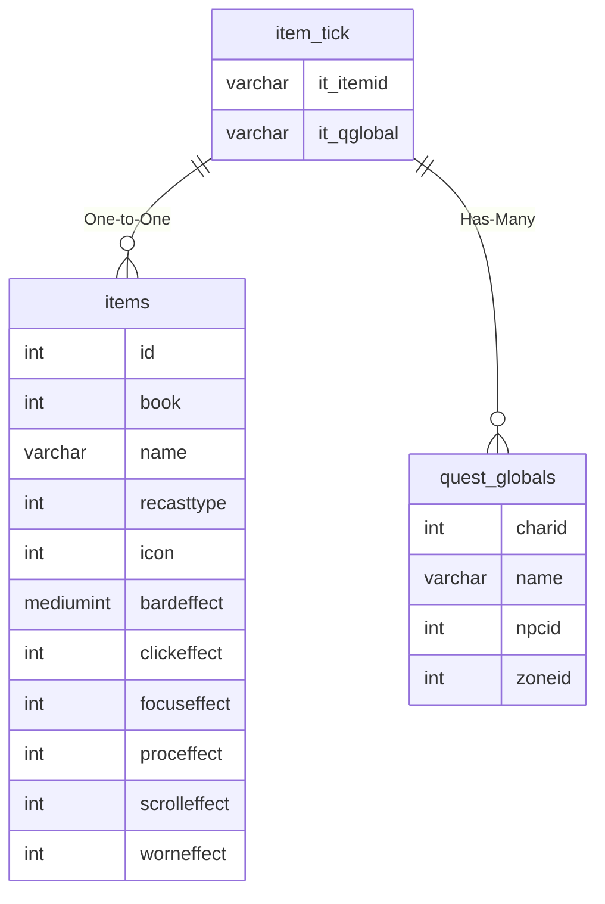

# item_tick

!!! info
	This page was last generated 2024.02.07

## Relationship Diagram(s)

## Relationships

| Relationship Type | Local Key | Relates to Table | Foreign Key |
| :--- | :--- | :--- | :--- |
| One-to-One | it_itemid | [items](../../schema/items/items.md) | id |
| Has-Many | it_qglobal | [quest_globals](../../schema/data-storage/quest_globals.md) | name |

## Schema

| Column | Data Type | Description |
| :--- | :--- | :--- |
| it_itemid | int | [Item Identifier](items.md) |
| it_chance | int | Chance: 0 = Never, 100 = Always |
| it_level | int | Level |
| it_id | int | [Spell Identifier](../../schema/spells/spells_new.md) |
| it_qglobal | varchar | [Quest Global Identifier](../../schema/data-storage/quest_globals.md) (Deprecated) |
| it_bagslot | tinyint | [Bag Slot](../../../../server/inventory/inventory-slots) |

