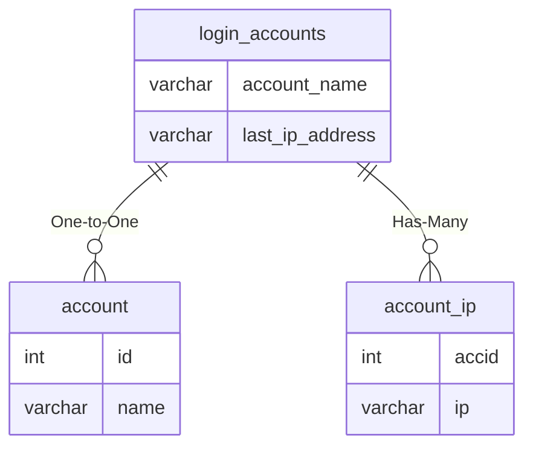

# login_accounts

## Relationships

| Relationship Type | Local Key | Relates to Table | Foreign Key |
| :--- | :--- | :--- | :--- |
| One-to-One | account_name | [account](../../schema/account/account.md) | name |
| Has-Many | last_ip_address | [account_ip](../../schema/account/account_ip.md) | ip |

## Schema

| Column | Data Type | Description |
| :--- | :--- | :--- |
| id | int | Unique Account Identifier |
| account_name | varchar | [Account Name](../../schema/account/account.md) |
| account_password | text | Account Password |
| account_email | varchar | Account Email |
| source_loginserver | varchar | Source Loginserver |
| last_ip_address | varchar | [Last IP Address](../../schema/account/account_ip.md) |
| last_login_date | datetime | Last Login Date |
| created_at | datetime | Created At Date |
| updated_at | datetime | Updated At Date |

