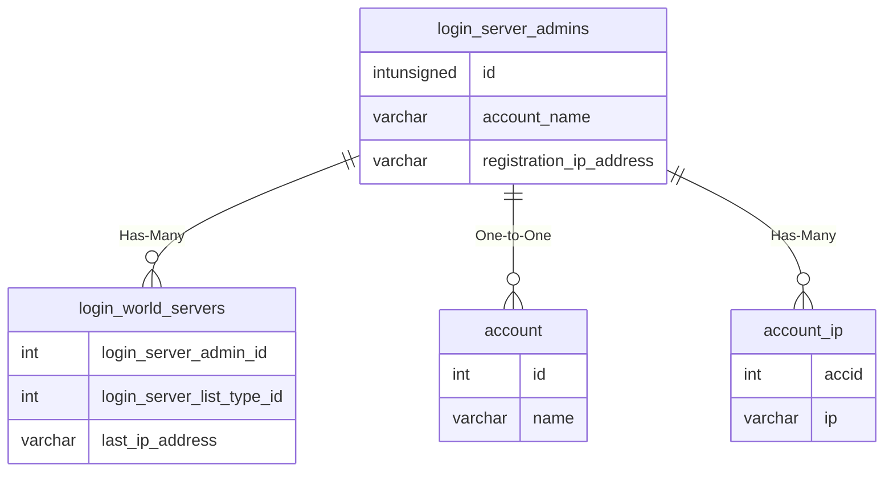

# login_server_admins

## Relationships

| Relationship Type | Local Key | Relates to Table | Foreign Key |
| :--- | :--- | :--- | :--- |
| Has-Many | id | [login_world_servers](../../schema/loginserver/login_world_servers.md) | login_server_admin_id |
| One-to-One | account_name | [account](../../schema/account/account.md) | name |
| Has-Many | registration_ip_address | [account_ip](../../schema/account/account_ip.md) | ip |

## Schema

| Column | Data Type | Description |
| :--- | :--- | :--- |
| id | int | Unique Account Identifier |
| account_name | varchar | Account Name |
| account_password | varchar | Account Password |
| first_name | varchar | First Name |
| last_name | varchar | Last Name |
| email | varchar | Email |
| registration_date | datetime | Registration Date |
| registration_ip_address | varchar | [Registration IP Address](../../schema/account/account_ip.md) |

