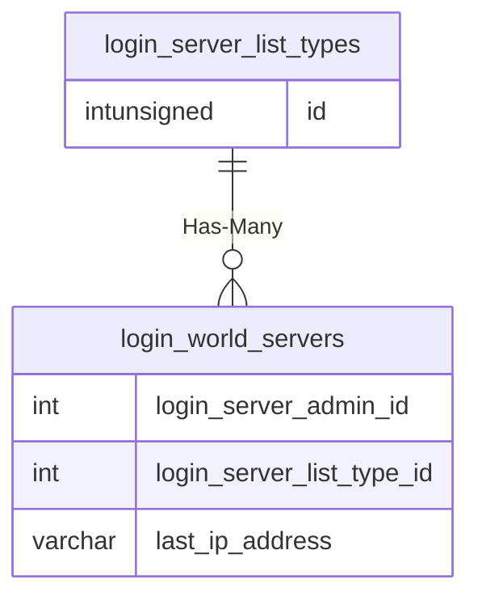

# login_server_list_types

!!! info
	This page was last generated 2024.02.07

## Relationship Diagram(s)

## Relationships

| Relationship Type | Local Key | Relates to Table | Foreign Key |
| :--- | :--- | :--- | :--- |
| Has-Many | id | [login_world_servers](../../schema/loginserver/login_world_servers.md) | login_server_list_type_id |

## Schema

| Column | Data Type | Description |
| :--- | :--- | :--- |
| id | int | Unique List Type Identifier |
| description | varchar | Description |

