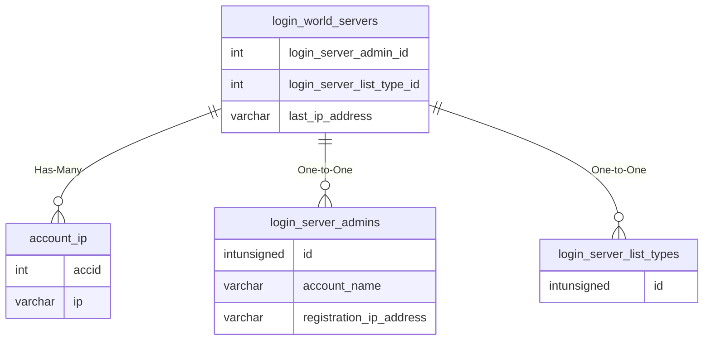

# login_world_servers

## Relationships

| Relationship Type | Local Key | Relates to Table | Foreign Key |
| :--- | :--- | :--- | :--- |
| Has-Many | last_ip_address | [account_ip](../../schema/account/account_ip.md) | ip |
| One-to-One | login_server_admin_id | [login_server_admins](../../schema/loginserver/login_server_admins.md) | id |
| One-to-One | login_server_list_type_id | [login_server_list_types](../../schema/loginserver/login_server_list_types.md) | id |

## Schema

| Column | Data Type | Description |
| :--- | :--- | :--- |
| id | int | Unique World Server Identifier |
| long_name | varchar | Long Name |
| short_name | varchar | Short Name |
| tag_description | varchar | Tag Description |
| login_server_list_type_id | int | List Type Identifier (1 Legends, 2 Preferred, 3 Standard) |
| last_login_date | datetime | Last Login Date |
| last_ip_address | varchar | Last IP Address |
| login_server_admin_id | int | [Login Server Admin Identifier](login_server_admins.md) |
| is_server_trusted | int | Is Server Trusted: 0 = False, 1 = True |
| note | varchar | Note |

