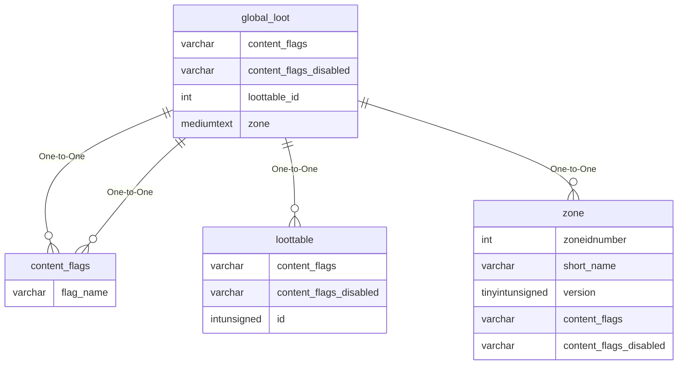

# global_loot

!!! info
	This page was last generated 2024.02.07

## Relationship Diagram(s)

## Relationships

| Relationship Type | Local Key | Relates to Table | Foreign Key |
| :--- | :--- | :--- | :--- |
| One-to-One | content_flags | [content_flags](../../schema/flagging/content_flags.md) | flag_name |
| One-to-One | content_flags_disabled | [content_flags](../../schema/flagging/content_flags.md) | flag_name |
| One-to-One | loottable_id | [loottable](../../schema/loot/loottable.md) | id |
| One-to-One | zone | [zone](../../schema/zone/zone.md) | short_name |

## Schema

| Column | Data Type | Description |
| :--- | :--- | :--- |
| id | int | Unique Global Loot Identifier |
| description | varchar | Description |
| loottable_id | int | [Loottable Identifier](loottable.md) |
| enabled | tinyint | Enabled: 0 = False, 1 = True |
| min_level | int | Minimum Level |
| max_level | int | Maximum Level |
| rare | tinyint | Rare: 0 = False, 1 = True |
| raid | tinyint | Raid: 0 = False, 1 = True |
| race | mediumtext | [Race](../../../../server/npc/race-list), multiple races supported if  |
| class | mediumtext | [Class](../../../../server/player/class-list), multiple classes supported if  |
| bodytype | mediumtext | [Body Type](../../../../server/npc/body-types), multiple body types supported if  |
| zone | mediumtext | [Zone Short Name](../../../../server/zones/zone-list),, multiple zones supported if  |
| hot_zone | tinyint | Hot Zone: 0 = False, 1 = True |
| min_expansion | tinyint | [Minimum Expansion](../../../../server/operation/expansion-list) |
| max_expansion | tinyint | [Maximum Expansion](../../../../server/operation/expansion-list) |
| content_flags | varchar | Content Flags Required to be Enabled |
| content_flags_disabled | varchar | Content Flags Required to be Disabled |

