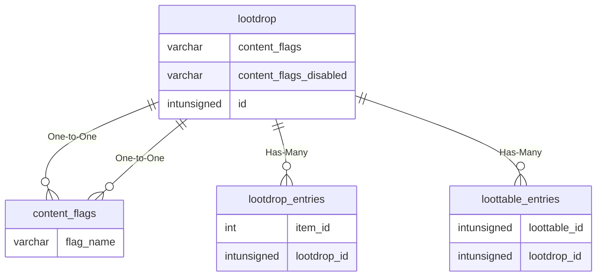

# lootdrop

!!! info
	This page was last generated 2024.02.07

## Relationship Diagram(s)

## Relationships

| Relationship Type | Local Key | Relates to Table | Foreign Key |
| :--- | :--- | :--- | :--- |
| One-to-One | content_flags | [content_flags](../../schema/flagging/content_flags.md) | flag_name |
| One-to-One | content_flags_disabled | [content_flags](../../schema/flagging/content_flags.md) | flag_name |
| Has-Many | id | [lootdrop_entries](../../schema/loot/lootdrop_entries.md) | lootdrop_id |
| Has-Many | id | [loottable_entries](../../schema/loot/loottable_entries.md) | loottable_id |

## Schema

| Column | Data Type | Description |
| :--- | :--- | :--- |
| id | int | Unique Lootdrop Identifier |
| name | varchar | Name |
| min_expansion | tinyint | [Minimum Expansion](../../../../server/operation/expansion-list) |
| max_expansion | tinyint | [Maximum Expansion](../../../../server/operation/expansion-list) |
| content_flags | varchar | Content Flags Required to be Enabled |
| content_flags_disabled | varchar | Content Flags Required to be Disabled |

