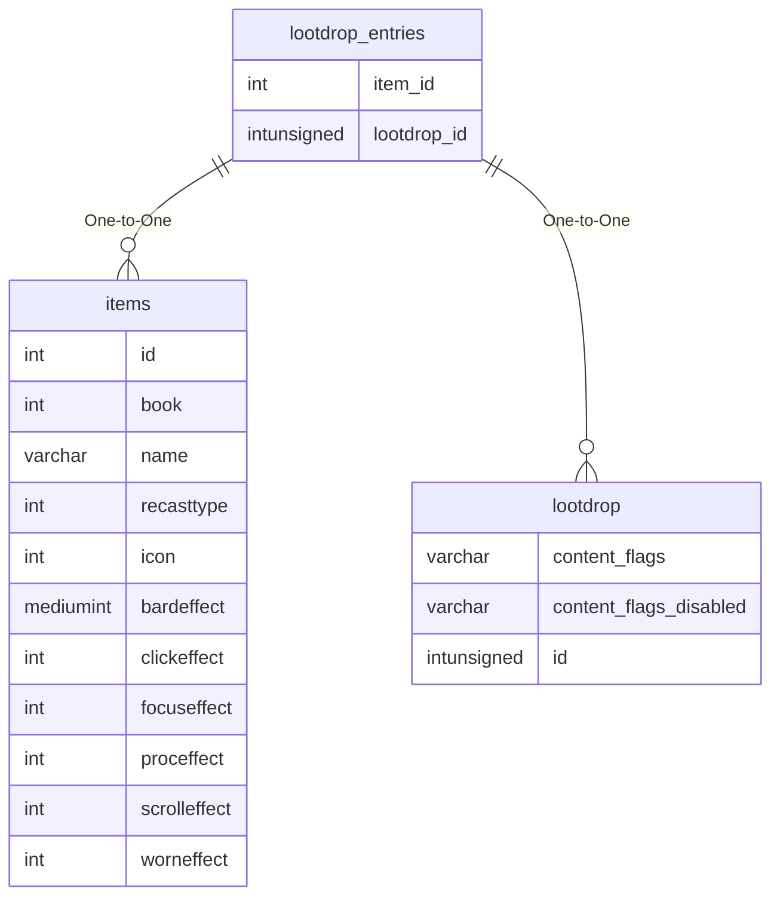

# lootdrop_entries

## Relationships

| Relationship Type | Local Key | Relates to Table | Foreign Key |
| :--- | :--- | :--- | :--- |
| One-to-One | item_id | [items](../../schema/items/items.md) | id |
| One-to-One | lootdrop_id | [lootdrop](../../schema/loot/lootdrop.md) | id |

## Schema

| Column | Data Type | Description |
| :--- | :--- | :--- |
| lootdrop_id | int | [Lootdrop Identifier](lootdrop.md) |
| item_id | int | [Item Identifier](../../schema/items/items.md) |
| item_charges | smallint | Item Charges |
| equip_item | tinyint | Equip Item: 0 = False, 1 = True |
| chance | float | Chance: 0 = Never, 100 = Always |
| disabled_chance | float | Disabled Chance: 0 = Never, 100 = Always |
| trivial_min_level | smallint | Trivial Minimum Level |
| trivial_max_level | smallint | Trivial Maximum Level |
| multiplier | tinyint | Multiplier |
| npc_min_level | smallint | NPC Minimum Level |
| npc_max_level | smallint | NPC Maximum Level |

