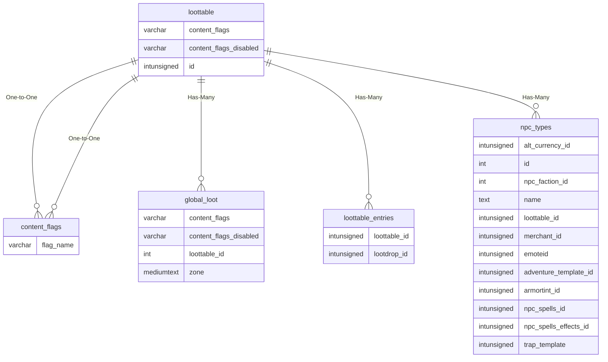

# loottable

## Relationships

| Relationship Type | Local Key | Relates to Table | Foreign Key |
| :--- | :--- | :--- | :--- |
| One-to-One | content_flags | [content_flags](../../schema/flagging/content_flags.md) | flag_name |
| One-to-One | content_flags_disabled | [content_flags](../../schema/flagging/content_flags.md) | flag_name |
| Has-Many | id | [global_loot](../../schema/loot/global_loot.md) | loottable_id |
| Has-Many | id | [loottable_entries](../../schema/loot/loottable_entries.md) | loottable_id |
| Has-Many | id | [npc_types](../../schema/npcs/npc_types.md) | loottable_id |

## Schema

| Column | Data Type | Description |
| :--- | :--- | :--- |
| id | int | Unique Loottable Identifier |
| name | varchar | Name |
| mincash | int | Minimum Cash in Copper |
| maxcash | int | Maximum Cash in Copper |
| avgcoin | int | Average Coin in Copper |
| done | tinyint | Done: 0 = False, 1 = True |
| min_expansion | tinyint | [Minimum Expansion](../../../../server/operation/expansion-list) |
| max_expansion | tinyint | [Maximum Expansion](../../../../server/operation/expansion-list) |
| content_flags | varchar | Content Flags Required to be Enabled |
| content_flags_disabled | varchar | Content Flags Required to be Disabled |

