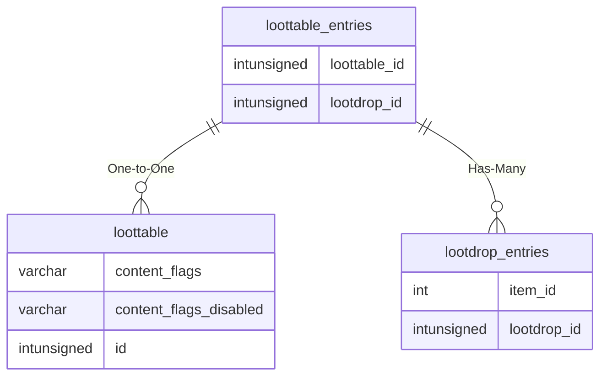

# loottable_entries

!!! info
	This page was last generated 2024.02.07

## Relationship Diagram(s)

## Relationships

| Relationship Type | Local Key | Relates to Table | Foreign Key |
| :--- | :--- | :--- | :--- |
| One-to-One | loottable_id | [loottable](../../schema/loot/loottable.md) | id |
| Has-Many | lootdrop_id | [lootdrop_entries](../../schema/loot/lootdrop_entries.md) | lootdrop_id |

## Schema

| Column | Data Type | Description |
| :--- | :--- | :--- |
| loottable_id | int | [Loottable Identifier](loottable.md) |
| lootdrop_id | int | [Lootdrop Identifier](lootdrop.md) |
| multiplier | tinyint | Multiplier |
| droplimit | tinyint | Maximum Drops |
| mindrop | tinyint | Minimum Drops |
| probability | float | Probability: 0 = Never, 100 = Always |

