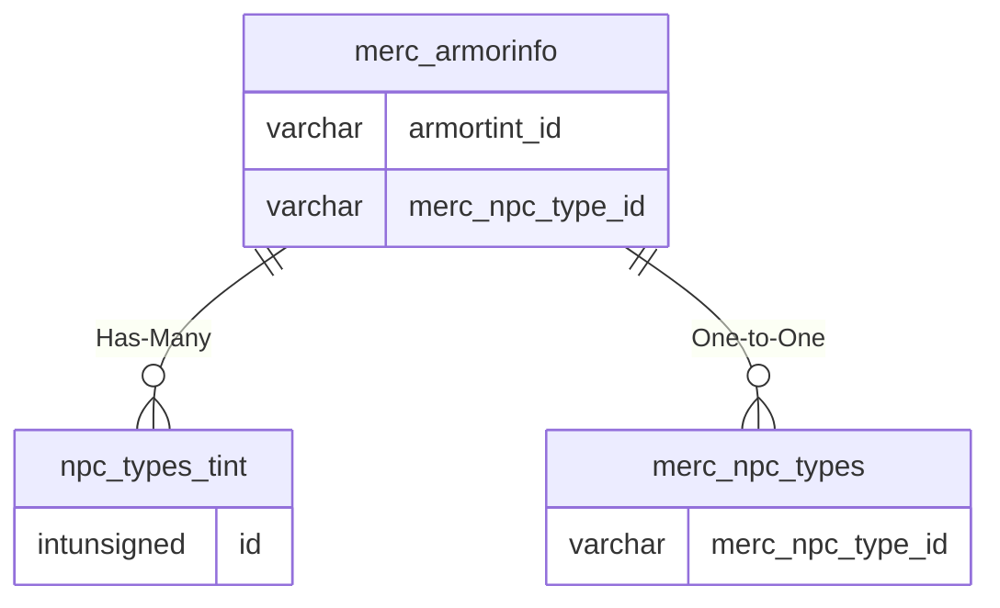

# merc_armorinfo

## Relationships

| Relationship Type | Local Key | Relates to Table | Foreign Key |
| :--- | :--- | :--- | :--- |
| Has-Many | armortint_id | [npc_types_tint](../../schema/npcs/npc_types_tint.md) | id |
| One-to-One | merc_npc_type_id | [merc_npc_types](../../schema/mercenaries/merc_npc_types.md) | merc_npc_type_id |

## Schema

| Column | Data Type | Description |
| :--- | :--- | :--- |
| id | int | Unique Mercenary Armor Info Identifier |
| merc_npc_type_id | int | [Mercenary NPC Type Identifier](merc_npc_types.md) |
| minlevel | tinyint | Minimum Level |
| maxlevel | tinyint | Maximum Level |
| texture | tinyint | [Texture](../../../../server/npc/textures) |
| helmtexture | tinyint | [Helmet Texture](../../../../server/npc/textures) |
| armortint_id | int | [Armor Tint Identifier](../../schema/npcs/npc_types_tint.md) |
| armortint_red | tinyint | Armor Tint Red: 0 = None, 255 = Max |
| armortint_green | tinyint | Armor Tint Green: 0 = None, 255 = Max |
| armortint_blue | tinyint | Armor Tint Blue: 0 = None, 255 = Max |

