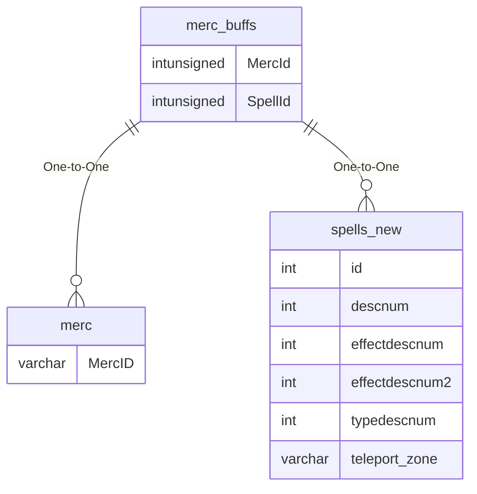

# merc_buffs

## Relationships

| Relationship Type | Local Key | Relates to Table | Foreign Key |
| :--- | :--- | :--- | :--- |
| One-to-One | MercId | merc | MercID |
| One-to-One | SpellId | [spells_new](../../schema/spells/spells_new.md) | id |

## Schema

| Column | Data Type | Description |
| :--- | :--- | :--- |
| MercBuffId | int | Unique Mercenary Buff Identifier |
| MercId | int | [Mercenary Identifier](mercs.md) |
| SpellId | int | [Spell Identifier](../../schema/spells/spells_new.md) |
| CasterLevel | int | Caster Level |
| DurationFormula | int | [Duration Formula](../../../../categories/spells/buff-duration-formulas) |
| TicsRemaining | int | Tics Remaining |
| PoisonCounters | int | Poison Counters |
| DiseaseCounters | int | Disease Counters |
| CurseCounters | int | Curse Counters |
| CorruptionCounters | int | Corruption Counters |
| HitCount | int | Hit Count |
| MeleeRune | int | Melee Rune |
| MagicRune | int | Magic Rune |
| dot_rune | int | Damage Over Time Rune |
| caston_x | int | Cast On X Coordinate |
| Persistent | tinyint | Persistent: 0 = False, 1 = True |
| caston_y | int | Cast On Y Coordinate |
| caston_z | int | Cast On Z Coordinate |
| ExtraDIChance | int | Extra DI Chance |

