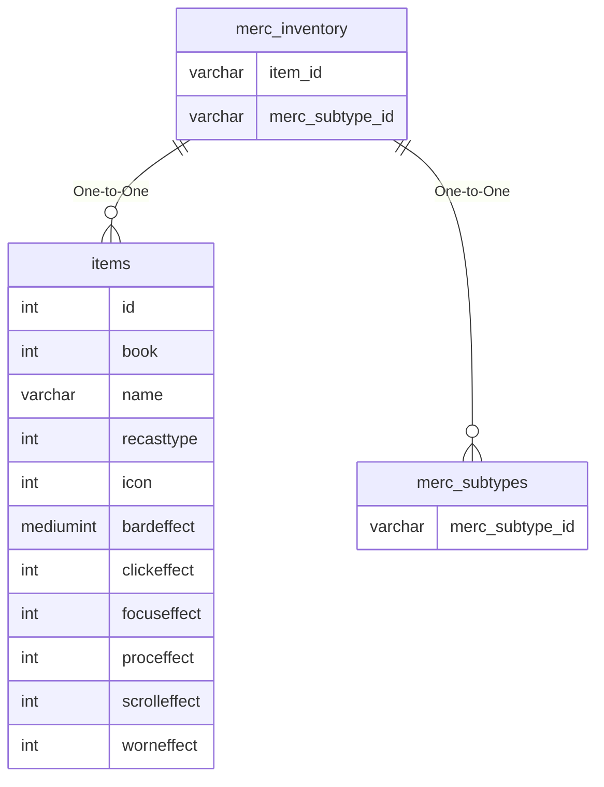

# merc_inventory

## Relationships

| Relationship Type | Local Key | Relates to Table | Foreign Key |
| :--- | :--- | :--- | :--- |
| One-to-One | item_id | [items](../../schema/items/items.md) | id |
| One-to-One | merc_subtype_id | [merc_subtypes](../../schema/mercenaries/merc_subtypes.md) | merc_subtype_id |

## Schema

| Column | Data Type | Description |
| :--- | :--- | :--- |
| merc_inventory_id | int | Unique Mercenary Inventory Identifier |
| merc_subtype_id | int | [Mercenary Subtype Identifier](merc_subtypes.md) |
| item_id | int | [Item Identifier](../../schema/items/items.md) |
| min_level | int | Minimum Level |
| max_level | int | Maximum Level |

