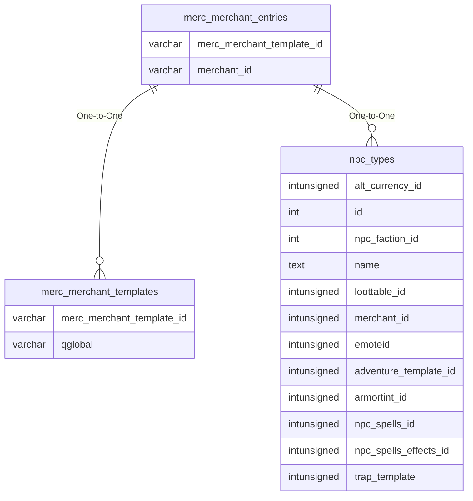

# merc_merchant_entries

!!! info
	This page was last generated 2024.02.07

## Relationship Diagram(s)

## Relationships

| Relationship Type | Local Key | Relates to Table | Foreign Key |
| :--- | :--- | :--- | :--- |
| One-to-One | merc_merchant_template_id | [merc_merchant_templates](../../schema/mercenaries/merc_merchant_templates.md) | merc_merchant_template_id |
| One-to-One | merchant_id | [npc_types](../../schema/npcs/npc_types.md) | id |

## Schema

| Column | Data Type | Description |
| :--- | :--- | :--- |
| merc_merchant_entry_id | int | Unique Mercenary Merchant Entry Identifier |
| merc_merchant_template_id | int | [Mercenary Merchant Template Identifier](merc_merchant_templates.md) |
| merchant_id | int | [Merchant Identifier](../merchants/merchantlist.md) |

