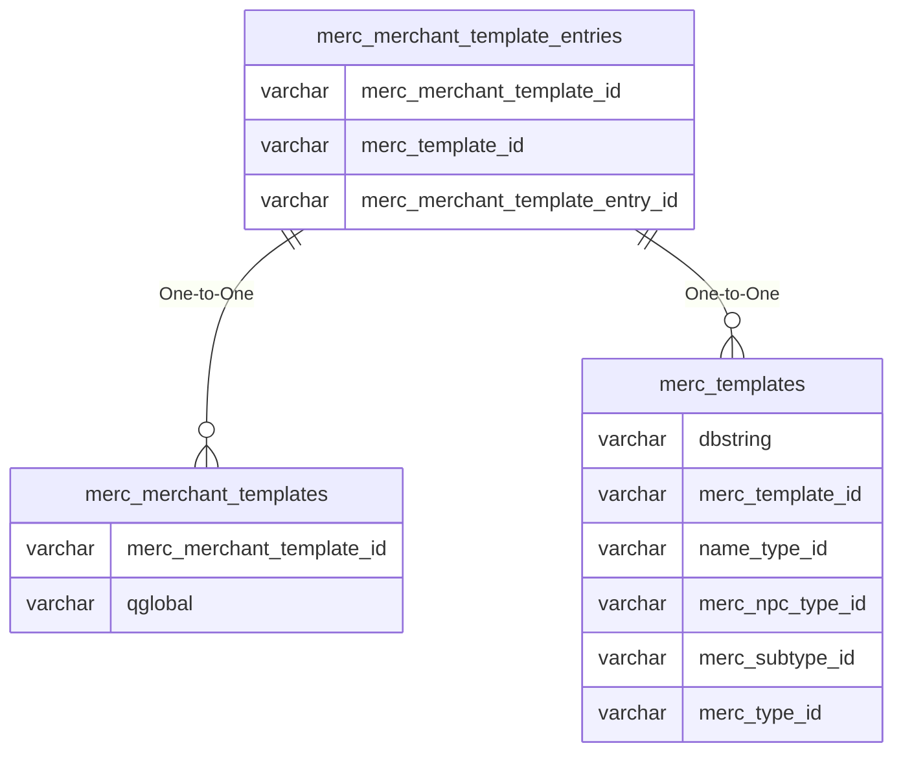

# merc_merchant_template_entries

## Relationships

| Relationship Type | Local Key | Relates to Table | Foreign Key |
| :--- | :--- | :--- | :--- |
| One-to-One | merc_merchant_template_id | [merc_merchant_templates](../../schema/mercenaries/merc_merchant_templates.md) | merc_merchant_template_id |
| One-to-One | merc_template_id | [merc_templates](../../schema/mercenaries/merc_templates.md) | merc_template_id |

## Schema

| Column | Data Type | Description |
| :--- | :--- | :--- |
| merc_merchant_template_entry_id | int | Unique Mercenary Merchant Template Entry Identifier |
| merc_merchant_template_id | int | [Mercenary Merchant Template Identifier](merc_merchant_templates.md) |
| merc_template_id | int | [Mercenary Template Identifier](merc_templates.md) |

