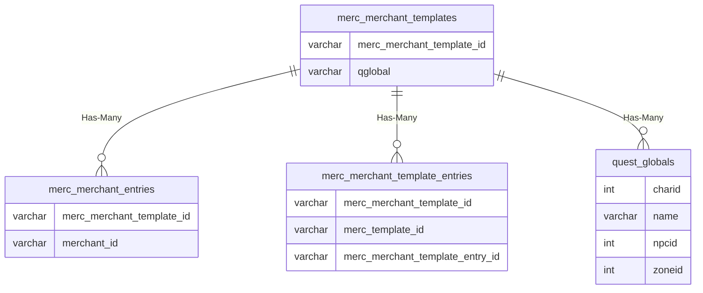

# merc_merchant_templates

!!! info
	This page was last generated 2024.02.07

## Relationship Diagram(s)

## Relationships

| Relationship Type | Local Key | Relates to Table | Foreign Key |
| :--- | :--- | :--- | :--- |
| Has-Many | merc_merchant_template_id | [merc_merchant_entries](../../schema/mercenaries/merc_merchant_entries.md) | merc_merchant_template_id |
| Has-Many | merc_merchant_template_id | [merc_merchant_template_entries](../../schema/mercenaries/merc_merchant_template_entries.md) | merc_merchant_template_id |
| Has-Many | qglobal | [quest_globals](../../schema/data-storage/quest_globals.md) | name |

## Schema

| Column | Data Type | Description |
| :--- | :--- | :--- |
| merc_merchant_template_id | int | Unique Mercenary Merchant Template Identifier |
| name | varchar | Name |
| qglobal | varchar | [Quest Global](../data-storage/quest_globals.md) (Deprecated) |

