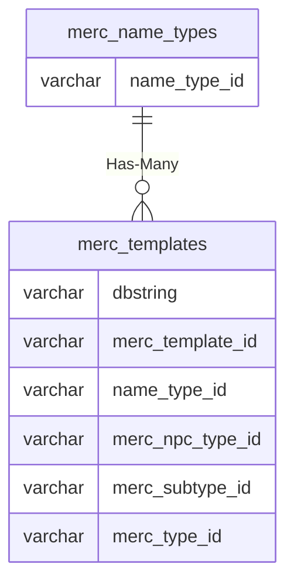

# merc_name_types

## Relationships

| Relationship Type | Local Key | Relates to Table | Foreign Key |
| :--- | :--- | :--- | :--- |
| Has-Many | name_type_id | [merc_templates](../../schema/mercenaries/merc_templates.md) | name_type_id |

## Schema

| Column | Data Type | Description |
| :--- | :--- | :--- |
| name_type_id | int | Mercenary Name Type Identifier |
| class_id | int | [Class Identifier](../../../../server/player/class-list) |
| prefix | varchar | Prefix |
| suffix | varchar | Suffix |

