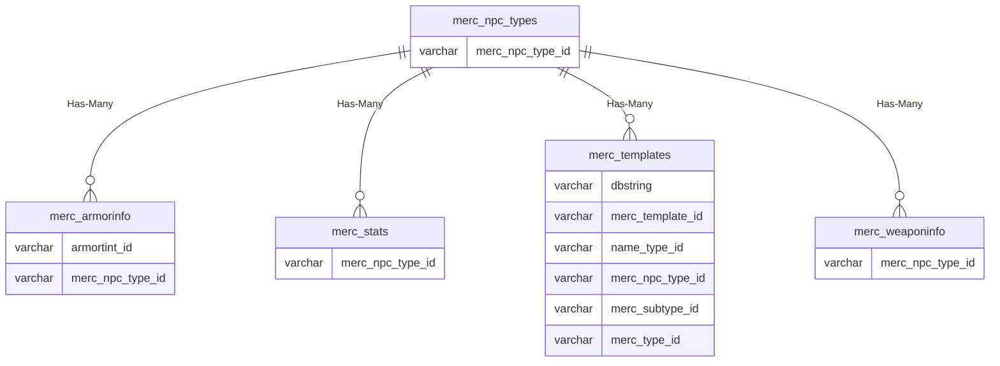

# merc_npc_types

## Relationships

| Relationship Type | Local Key | Relates to Table | Foreign Key |
| :--- | :--- | :--- | :--- |
| Has-Many | merc_npc_type_id | [merc_armorinfo](../../schema/mercenaries/merc_armorinfo.md) | merc_npc_type_id |
| Has-Many | merc_npc_type_id | [merc_stats](../../schema/mercenaries/merc_stats.md) | merc_npc_type_id |
| Has-Many | merc_npc_type_id | [merc_templates](../../schema/mercenaries/merc_templates.md) | merc_npc_type_id |
| Has-Many | merc_npc_type_id | [merc_weaponinfo](../../schema/mercenaries/merc_weaponinfo.md) | merc_npc_type_id |

## Schema

| Column | Data Type | Description |
| :--- | :--- | :--- |
| merc_npc_type_id | int | Mercenary NPC Type Identifier |
| proficiency_id | tinyint | Proficiency Identifier |
| tier_id | tinyint | Tier Identifier |
| class_id | int | [Class Identifier](../../../../server/player/class-list) |
| name | varchar | Name |

