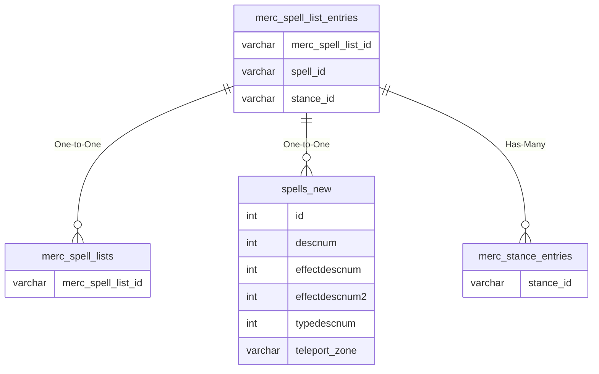

# merc_spell_list_entries

!!! info
	This page was last generated 2024.02.07

## Relationship Diagram(s)

## Relationships

| Relationship Type | Local Key | Relates to Table | Foreign Key |
| :--- | :--- | :--- | :--- |
| One-to-One | merc_spell_list_id | [merc_spell_lists](../../schema/mercenaries/merc_spell_lists.md) | merc_spell_list_id |
| One-to-One | spell_id | [spells_new](../../schema/spells/spells_new.md) | id |
| Has-Many | stance_id | [merc_stance_entries](../../schema/mercenaries/merc_stance_entries.md) | stance_id |

## Schema

| Column | Data Type | Description |
| :--- | :--- | :--- |
| merc_spell_list_entry_id | int | Unique Mercenary Spell List Entry Identifier |
| merc_spell_list_id | int | [Mercenary Spell List Identifier](merc_spell_lists.md) |
| spell_id | int | [Spell Identifier](../../schema/spells/spells_new.md) |
| spell_type | int | [Spell Type](../../../../server/spells/spell-types) |
| stance_id | tinyint | [Stance Type Identifier](../../../../categories/bots/stance-types) |
| minlevel | tinyint | Minimum Level |
| maxlevel | tinyint | Maximum Level |
| slot | tinyint | Slot |
| procChance | tinyint | Proc Chance: 0 = Never, 100 = Always |

