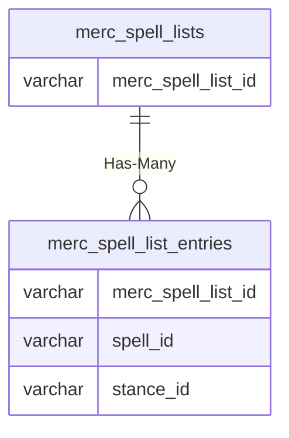

# merc_spell_lists

!!! info
	This page was last generated 2024.02.07

## Relationship Diagram(s)

## Relationships

| Relationship Type | Local Key | Relates to Table | Foreign Key |
| :--- | :--- | :--- | :--- |
| Has-Many | merc_spell_list_id | [merc_spell_list_entries](../../schema/mercenaries/merc_spell_list_entries.md) | merc_spell_list_id |

## Schema

| Column | Data Type | Description |
| :--- | :--- | :--- |
| merc_spell_list_id | int | Unique Mercenary Spell List Identifier |
| class_id | int | [Class Identifier](../../../../server/player/class-list) |
| proficiency_id | tinyint | Proficiency Identifier |
| name | varchar | Name |

