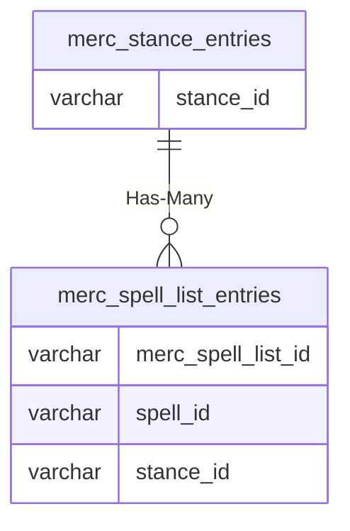

# merc_stance_entries

## Relationships

| Relationship Type | Local Key | Relates to Table | Foreign Key |
| :--- | :--- | :--- | :--- |
| Has-Many | stance_id | [merc_spell_list_entries](../../schema/mercenaries/merc_spell_list_entries.md) | stance_id |

## Schema

| Column | Data Type | Description |
| :--- | :--- | :--- |
| merc_stance_entry_id | int | Unique Mercenary Stance Entry Identifier |
| class_id | int | [Class Identifier](../../../../server/player/class-list) |
| proficiency_id | tinyint | Proficiency Identifier |
| stance_id | tinyint | [Stance Type Identifier](../../../../server/bots/stance-types) |
| isdefault | tinyint | Is Default: 0 = False, 1 = True |

