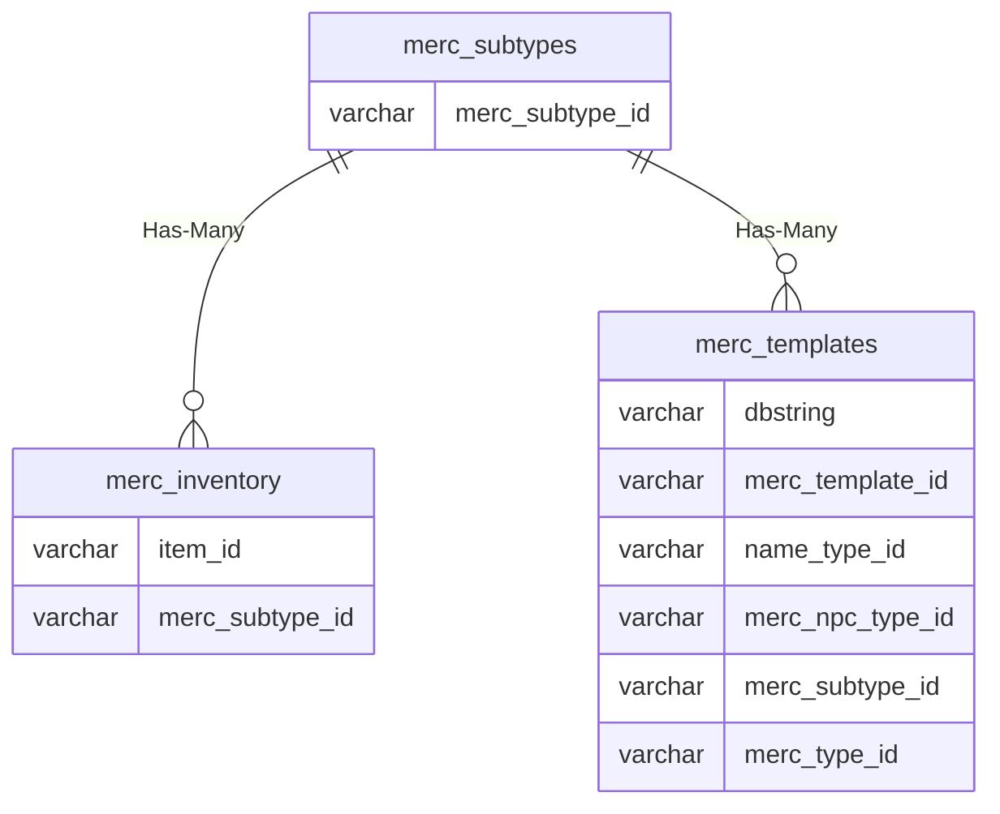

# merc_subtypes

## Relationships

| Relationship Type | Local Key | Relates to Table | Foreign Key |
| :--- | :--- | :--- | :--- |
| Has-Many | merc_subtype_id | [merc_inventory](../../schema/mercenaries/merc_inventory.md) | merc_subtype_id |
| Has-Many | merc_subtype_id | [merc_templates](../../schema/mercenaries/merc_templates.md) | merc_subtype_id |

## Schema

| Column | Data Type | Description |
| :--- | :--- | :--- |
| merc_subtype_id | int | Unique Mercenary Subtype Identifier |
| class_id | int | [Class Identifier](../../../../server/player/class-list) |
| tier_id | tinyint | Tier Identifier |
| confidence_id | tinyint | Confidence Identifier |

