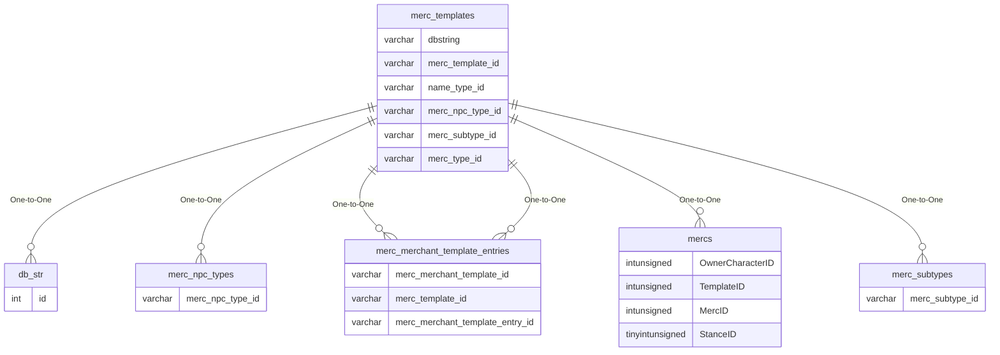
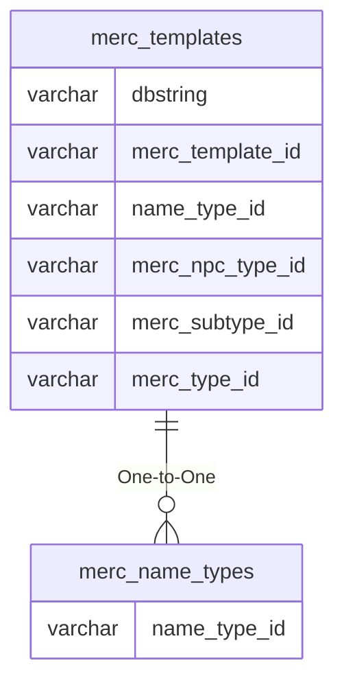

# merc_templates

!!! info
	This page was last generated 2024.02.07

## Relationship Diagram(s)

## Relationships

| Relationship Type | Local Key | Relates to Table | Foreign Key |
| :--- | :--- | :--- | :--- |
| One-to-One | dbstring | [db_str](../../schema/client-files/db_str.md) | id |
| One-to-One | merc_npc_type_id | [merc_npc_types](../../schema/mercenaries/merc_npc_types.md) | merc_npc_type_id |
| One-to-One | merc_template_id | [merc_merchant_template_entries](../../schema/mercenaries/merc_merchant_template_entries.md) | merc_merchant_template_entry_id |
| One-to-One | merc_template_id | [merc_merchant_template_entries](../../schema/mercenaries/merc_merchant_template_entries.md) | merc_template_id |
| One-to-One | merc_template_id | [mercs](../../schema/mercenaries/mercs.md) | TemplateID |
| One-to-One | merc_subtype_id | [merc_subtypes](../../schema/mercenaries/merc_subtypes.md) | merc_subtype_id |
| One-to-One | name_type_id | [merc_name_types](../../schema/mercenaries/merc_name_types.md) | name_type_id |

## Schema

| Column | Data Type | Description |
| :--- | :--- | :--- |
| merc_template_id | int | Unique Mercenary Template Identifier |
| merc_type_id | int | [Mercenary Type Identifier](merc_types.md) |
| merc_subtype_id | int | [Mercenary Subtype Identifier](merc_subtypes.md) |
| merc_npc_type_id | int | [Mercenary NPC Type Identifier](merc_npc_types.md) |
| dbstring | varchar | [DBString Identifier](../../schema/client-files/db_str.md) |
| name_type_id | tinyint | [Name Type Identifier](merc_name_types.md) |
| clientversion | int | [Client Version](../../../../categories/player/client-version-bitmasks) |

