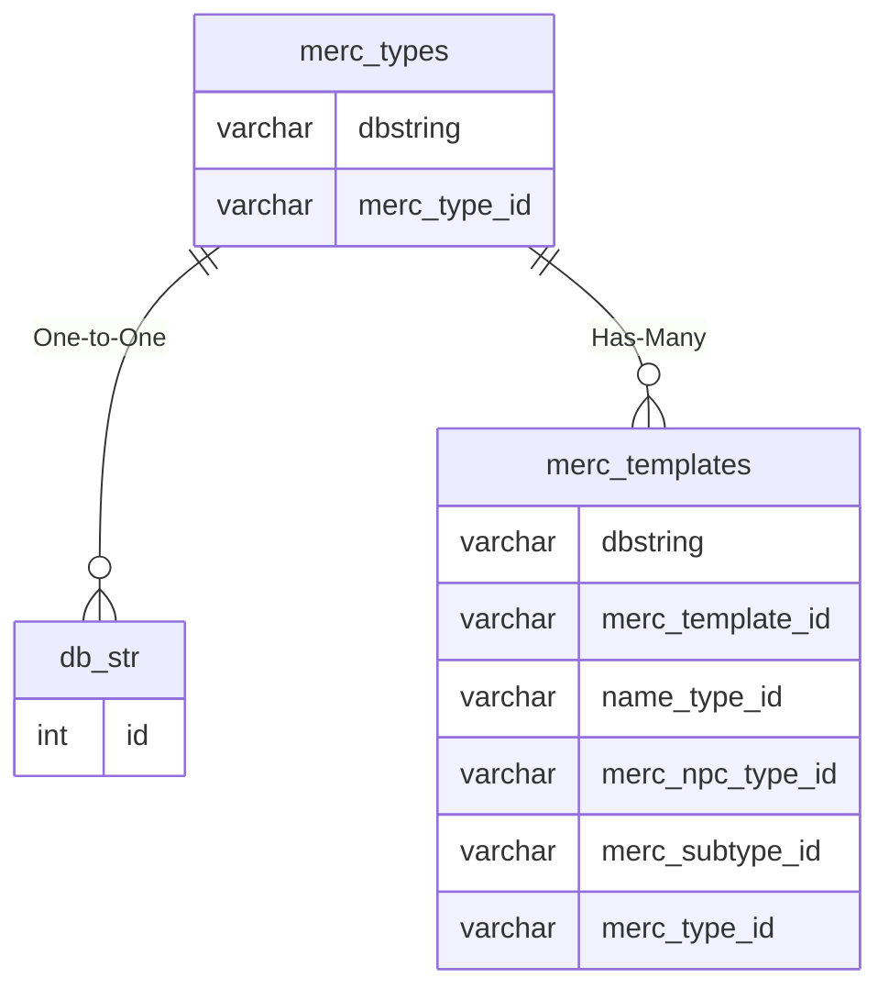

# merc_types

!!! info
	This page was last generated 2024.02.07

## Relationship Diagram(s)

## Relationships

| Relationship Type | Local Key | Relates to Table | Foreign Key |
| :--- | :--- | :--- | :--- |
| One-to-One | dbstring | [db_str](../../schema/client-files/db_str.md) | id |
| Has-Many | merc_type_id | [merc_templates](../../schema/mercenaries/merc_templates.md) | merc_type_id |

## Schema

| Column | Data Type | Description |
| :--- | :--- | :--- |
| merc_type_id | int | Unique Mercenary Type Identifier |
| race_id | int | [Race Identifier](../../../../categories/npc/race-list) |
| proficiency_id | tinyint | Proficiency Identifier |
| dbstring | varchar | [DBString Identifier](../../schema/client-files/db_str.md) |
| clientversion | int | [Client Version](../../../../categories/player/client-version-bitmasks) |

