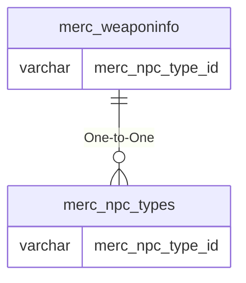

# merc_weaponinfo

## Relationships

| Relationship Type | Local Key | Relates to Table | Foreign Key |
| :--- | :--- | :--- | :--- |
| One-to-One | merc_npc_type_id | [merc_npc_types](../../schema/mercenaries/merc_npc_types.md) | merc_npc_type_id |

## Schema

| Column | Data Type | Description |
| :--- | :--- | :--- |
| id | int | Unique Mercenary Weapon Info Identifier |
| merc_npc_type_id | int | [Mercenary NPC Type Identifier](merc_npc_types.md) |
| minlevel | tinyint | Minimum Level |
| maxlevel | tinyint | Maximum Level |
| d_melee_texture1 | int | Primary Weapon Texture |
| d_melee_texture2 | int | Secondary Weapon Texture |
| prim_melee_type | tinyint | [Primary Melee Type](../../../../server/player/skills) |
| sec_melee_type | tinyint | [Secondary Melee Type](../../../../categories/player/skills) |

