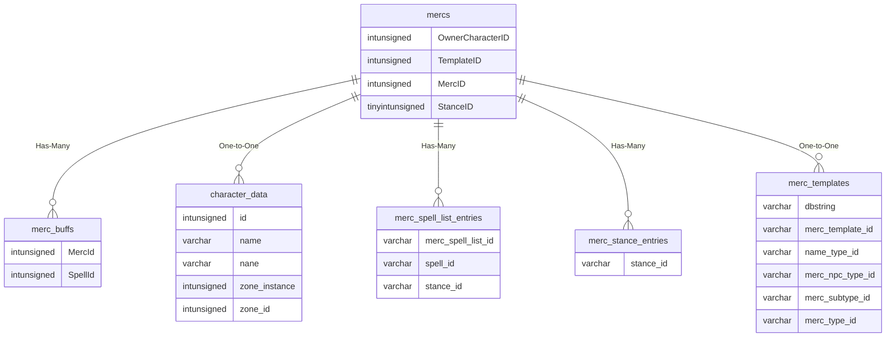

# mercs

!!! info
	This page was last generated 2024.02.07

## Relationship Diagram(s)

## Relationships

| Relationship Type | Local Key | Relates to Table | Foreign Key |
| :--- | :--- | :--- | :--- |
| Has-Many | MercID | [merc_buffs](../../schema/mercenaries/merc_buffs.md) | MercId |
| One-to-One | OwnerCharacterID | [character_data](../../schema/characters/character_data.md) | id |
| Has-Many | StanceID | [merc_spell_list_entries](../../schema/mercenaries/merc_spell_list_entries.md) | stance_id |
| Has-Many | StanceID | [merc_stance_entries](../../schema/mercenaries/merc_stance_entries.md) | stance_id |
| One-to-One | TemplateID | [merc_templates](../../schema/mercenaries/merc_templates.md) | merc_template_id |

## Schema

| Column | Data Type | Description |
| :--- | :--- | :--- |
| MercID | int | Unique Mercenary Identifier |
| OwnerCharacterID | int | [Owner Character Identifier](../../schema/characters/character_data.md) |
| Slot | tinyint | Slot |
| Name | varchar | Name |
| TemplateID | int | [Template Identifier](merc_templates.md) |
| SuspendedTime | int | Suspended Time UNIX Timestamp |
| IsSuspended | tinyint | Is Suspended: 0 = False, 1 = True |
| TimerRemaining | int | Timer Remaining in Seconds |
| Gender | tinyint | [Gender](../../../../server/npc/genders) |
| MercSize | float | Mercenary Size |
| StanceID | tinyint | [Stance Type Identifier](../../../../server/bots/stance-types) |
| HP | int | Health |
| Mana | int | Mana |
| Endurance | int | Endurance |
| Face | int | Face |
| LuclinHairStyle | int | Hair Style |
| LuclinHairColor | int | Hair Color |
| LuclinEyeColor | int | Eye Color 1 |
| LuclinEyeColor2 | int | Eye Color 2 |
| LuclinBeardColor | int | Beard Color |
| LuclinBeard | int | Beard |
| DrakkinHeritage | int | Drakkin Heritage |
| DrakkinTattoo | int | Drakkin Tattoo |
| DrakkinDetails | int | Drakkin Details |

