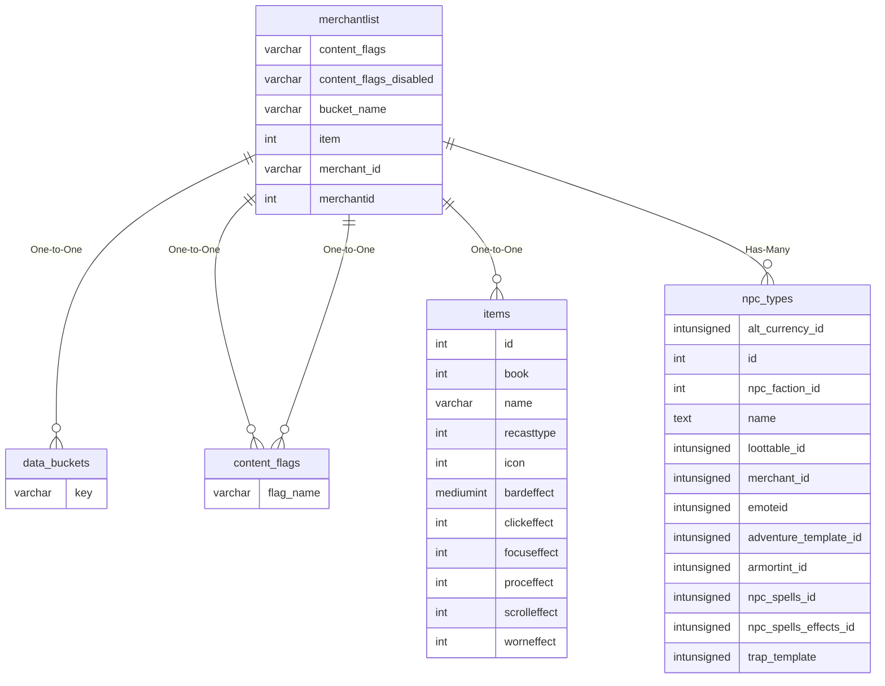

# merchantlist

## Relationships

| Relationship Type | Local Key | Relates to Table | Foreign Key |
| :--- | :--- | :--- | :--- |
| One-to-One | bucket_name | [data_buckets](../../schema/data-storage/data_buckets.md) | key |
| One-to-One | content_flags | [content_flags](../../schema/flagging/content_flags.md) | flag_name |
| One-to-One | content_flags_disabled | [content_flags](../../schema/flagging/content_flags.md) | flag_name |
| One-to-One | item | [items](../../schema/items/items.md) | id |
| Has-Many | merchant_id | [npc_types](../../schema/npcs/npc_types.md) | merchant_id |

## Schema

| Column | Data Type | Description |
| :--- | :--- | :--- |
| merchantid | int | Merchant Identifier |
| slot | int | Slot |
| item | int | [Item Identifier](../../schema/items/items.md) |
| faction_required | smallint | Faction Required |
| level_required | tinyint | Level Required |
| min_status | tinyint | [Minimum Status](../../../../server/player/status-levels) |
| max_status | tinyint | [Maximum Status](../../../../server/player/status-levels) |
| alt_currency_cost | smallint | [Alternate Currency Cost](../../schema/alternate-currency/alternate_currency.md) |
| classes_required | int | [Classes Required](../../../../server/player/class-list) |
| probability | int | Probability: 0 = Never, 100 = Always |
| bucket_name | varchar | Bucket Name |
| bucket_value | varchar | Bucket Value |
| bucket_comparison | tinyint | [Bucket Comparison Type](../../../../server/scripting/merchant-data-buckets) |
| min_expansion | tinyint | [Minimum Expansion](../../../../server/operation/expansion-list) |
| max_expansion | tinyint | [Maximum Expansion](../../../../server/operation/expansion-list) |
| content_flags | varchar | Content Flags Required to be Enabled |
| content_flags_disabled | varchar | Content Flags Required to be Disabled |

