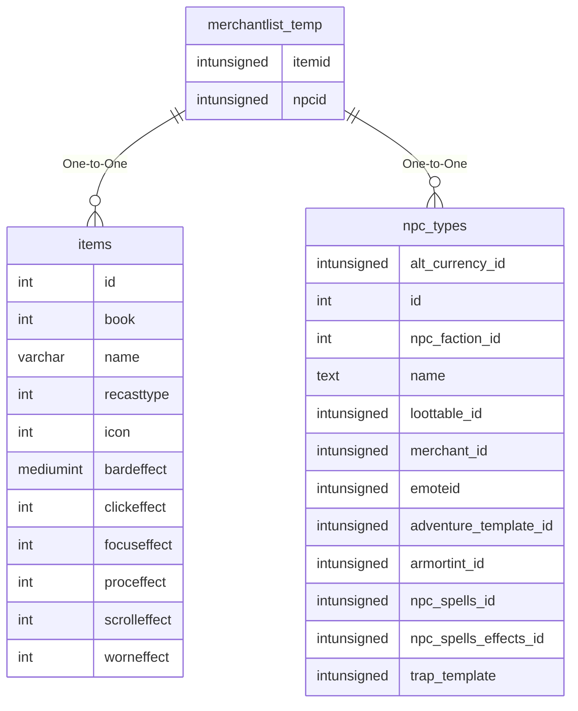

# merchantlist_temp

!!! info
	This page was last generated 2024.02.07

## Relationship Diagram(s)

## Relationships

| Relationship Type | Local Key | Relates to Table | Foreign Key |
| :--- | :--- | :--- | :--- |
| One-to-One | itemid | [items](../../schema/items/items.md) | id |
| One-to-One | npcid | [npc_types](../../schema/npcs/npc_types.md) | id |

## Schema

| Column | Data Type | Description |
| :--- | :--- | :--- |
| npcid | int | [NPC Type Identifier](../../schema/npcs/npc_types.md) |
| slot | int | Slot |
| zone_id | int | [Zone Identifier](../../../../server/zones/zone-list) |
| instance_id | int | [Instance Identifier](../../schema/instances/instance_list.md) |
| itemid | int | [Item Identifier](../../schema/items/items.md) |
| charges | int | Charges |

