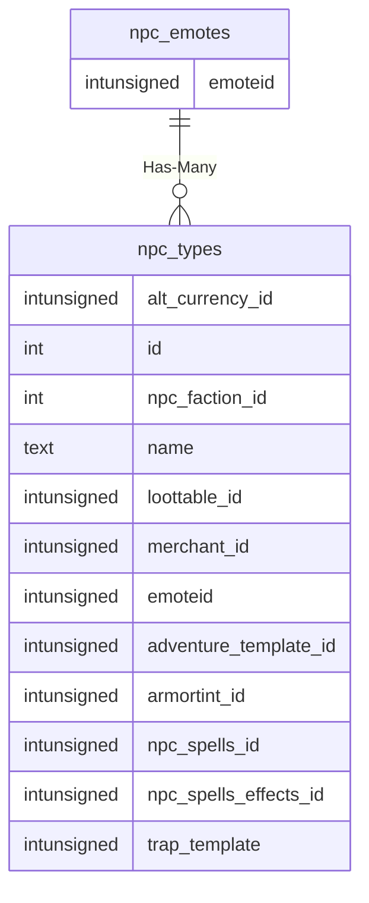

# npc_emotes

## Relationships

| Relationship Type | Local Key | Relates to Table | Foreign Key |
| :--- | :--- | :--- | :--- |
| Has-Many | emoteid | [npc_types](../../schema/npcs/npc_types.md) | emoteid |

## Schema

| Column | Data Type | Description |
| :--- | :--- | :--- |
| id | int | Unique NPC Emote Identifier |
| emoteid | int | Emote Identifier |
| event_ | tinyint | [Emote Event Type Identifier](../../../../server/npc/emote-event-types) |
| type | tinyint | [Emote Type Identifier](../../../../server/npc/emote-types) |
| text | varchar | Text |

