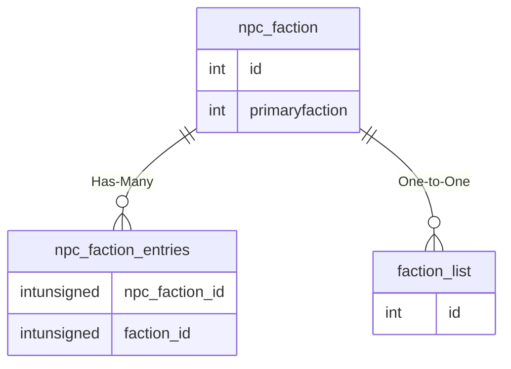

# npc_faction

!!! info
	This page was last generated 2024.02.07

## Relationship Diagram(s)

## Relationships

| Relationship Type | Local Key | Relates to Table | Foreign Key |
| :--- | :--- | :--- | :--- |
| Has-Many | id | [npc_faction_entries](../../schema/npcs/npc_faction_entries.md) | npc_faction_id |
| One-to-One | primaryfaction | [faction_list](../../schema/factions/faction_list.md) | id |

## Schema

| Column | Data Type | Description |
| :--- | :--- | :--- |
| id | int | Unique NPC Faction Identifier |
| name | tinytext | Name |
| primaryfaction | int | [Primary Faction Identifier](../../schema/factions/faction_list.md) |
| ignore_primary_assist | tinyint | Ignore Primary Assist: 0 = False, &gt;0 = True |

