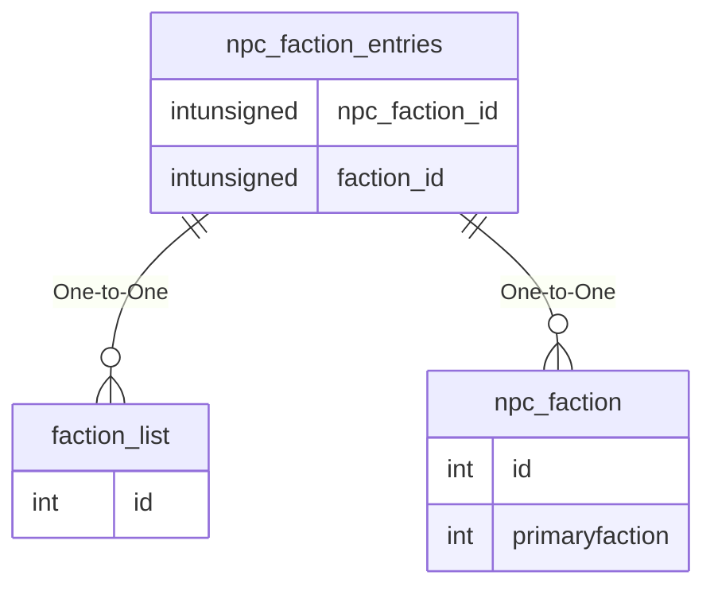

# npc_faction_entries

!!! info
	This page was last generated 2024.02.07

## Relationship Diagram(s)

## Relationships

| Relationship Type | Local Key | Relates to Table | Foreign Key |
| :--- | :--- | :--- | :--- |
| One-to-One | faction_id | [faction_list](../../schema/factions/faction_list.md) | id |
| One-to-One | npc_faction_id | [npc_faction](../../schema/npcs/npc_faction.md) | id |

## Schema

| Column | Data Type | Description |
| :--- | :--- | :--- |
| npc_faction_id | int | [NPC Faction Identifier](npc_faction.md) |
| faction_id | int | [Faction Identifier](../../schema/factions/faction_list.md) |
| value | int | Value |
| npc_value | tinyint | NPC Value: -1 = Attack, 0 = Neutral, 1 = Assist |
| temp | tinyint | Temeporary: 0 = Faction is permanent, player recieves a message, 1 = Faction is temporary, player does not recieve a message, 2 = Faction is temporary, player recieves a message, 3 = Faction is permanent, but player does not recieve a message. |

