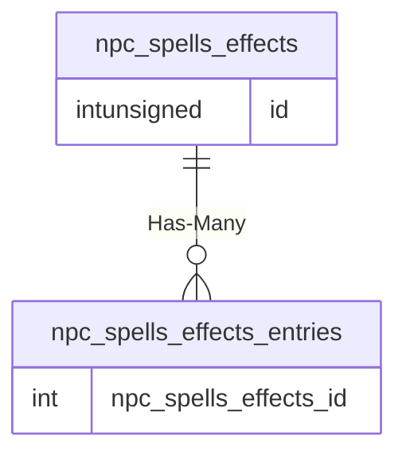

# npc_spells_effects

!!! info
	This page was last generated 2024.02.07

## Relationship Diagram(s)

## Relationships

| Relationship Type | Local Key | Relates to Table | Foreign Key |
| :--- | :--- | :--- | :--- |
| Has-Many | id | [npc_spells_effects_entries](../../schema/npcs/npc_spells_effects_entries.md) | npc_spells_effects_id |

## Schema

| Column | Data Type | Description |
| :--- | :--- | :--- |
| id | int | Unique Spell Effects Identifier |
| name | tinytext | Name |
| parent_list | int | Parent List |

