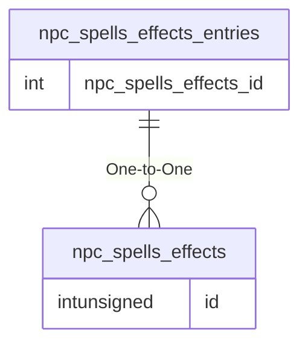

# npc_spells_effects_entries

!!! info
	This page was last generated 2024.02.07

## Relationship Diagram(s)

## Relationships

| Relationship Type | Local Key | Relates to Table | Foreign Key |
| :--- | :--- | :--- | :--- |
| One-to-One | npc_spells_effects_id | [npc_spells_effects](../../schema/npcs/npc_spells_effects.md) | id |

## Schema

| Column | Data Type | Description |
| :--- | :--- | :--- |
| id | int | Unique Spell Effect Entry Identifier |
| npc_spells_effects_id | int | [NPC Spells Effects Identifier](npc_spells_effects.md) |
| spell_effect_id | smallint | [Spell Effect Identifier](../../../../server/spells/spell-effect-ids) |
| minlevel | tinyint | Minimum Level |
| maxlevel | tinyint | Maximum Level |
| se_base | int | Spell Effect Base |
| se_limit | int | Spell Effect Limit |
| se_max | int | Spell Effect Maximum |

