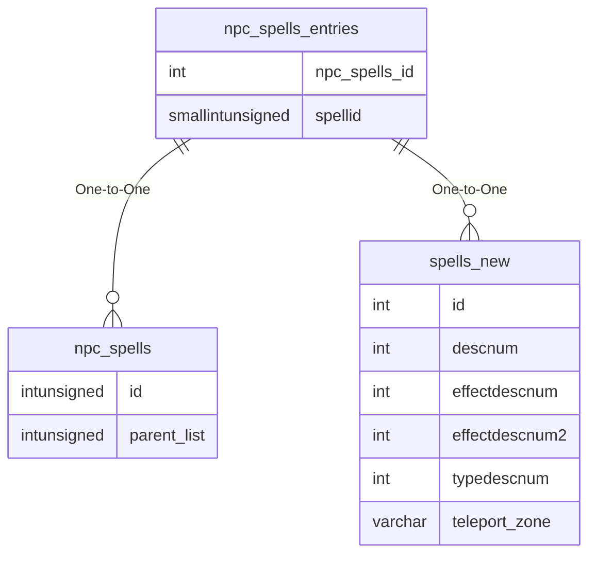

# npc_spells_entries

!!! info
	This page was last generated 2024.02.07

## Relationship Diagram(s)

## Relationships

| Relationship Type | Local Key | Relates to Table | Foreign Key |
| :--- | :--- | :--- | :--- |
| One-to-One | npc_spells_id | [npc_spells](../../schema/npcs/npc_spells.md) | id |
| One-to-One | spellid | [spells_new](../../schema/spells/spells_new.md) | id |

## Schema

| Column | Data Type | Description |
| :--- | :--- | :--- |
| id | int | Unique NPC Spell Entry Identifier |
| npc_spells_id | int | [Unique NPC Spell Set Identifier](npc_spells.md) |
| spellid | smallint | [Spell Identifier](../../schema/spells/spells_new.md) |
| type | int | [Spell Type Bitmask](../../../../server/spells/spell-types) |
| minlevel | tinyint | Minimum Level |
| maxlevel | tinyint | Maximum Level |
| manacost | smallint | Mana Cost |
| recast_delay | int | Recast Delay |
| priority | smallint | Priority: 0 = Innate, 1 = Highest Priority, 5 = Lower Priority, 10 = Even Lower Priority |
| resist_adjust | int | Resist Adjustment |
| min_hp | smallint | Minimum Health Percentage |
| max_hp | smallint | Maximum Health Percentage |

