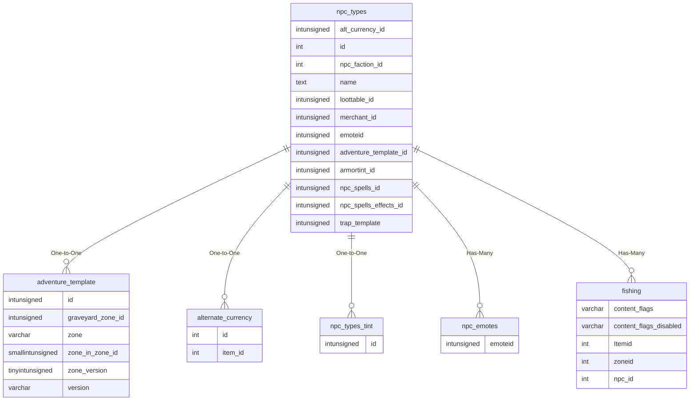
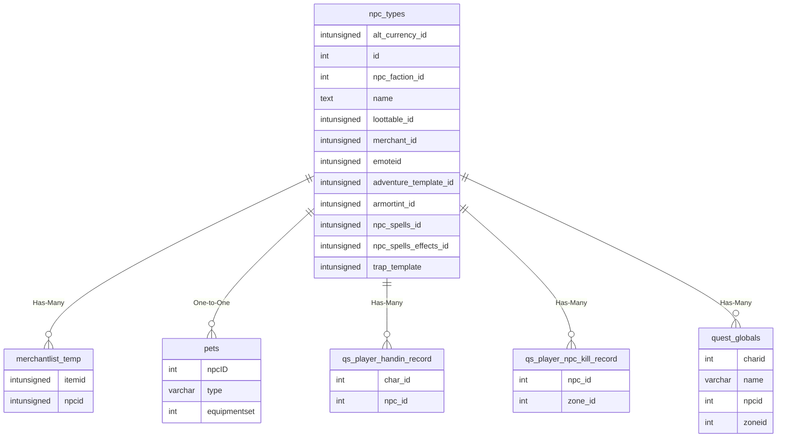
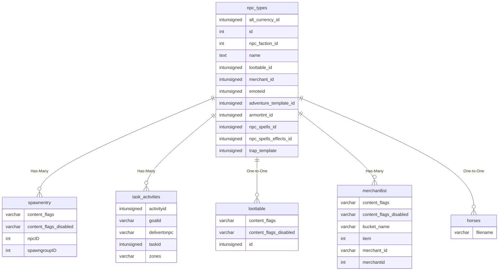
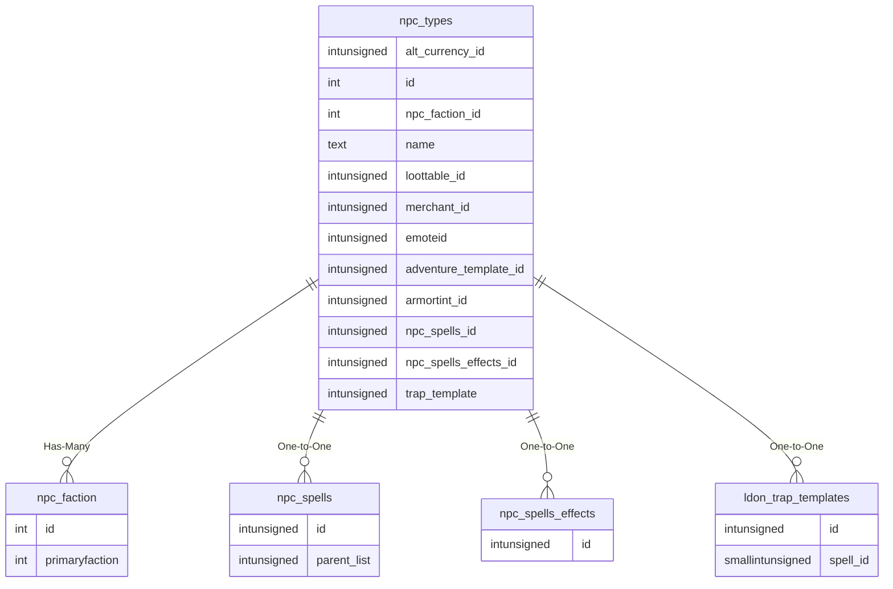

# npc_types

!!! info
	This page was last generated 2024.02.07

## Relationship Diagram(s)

## Relationships

| Relationship Type | Local Key | Relates to Table | Foreign Key |
| :--- | :--- | :--- | :--- |
| One-to-One | adventure_template_id | [adventure_template](../../schema/adventures/adventure_template.md) | id |
| One-to-One | alt_currency_id | [alternate_currency](../../schema/alternate-currency/alternate_currency.md) | id |
| One-to-One | armortint_id | [npc_types_tint](../../schema/npcs/npc_types_tint.md) | id |
| Has-Many | emoteid | [npc_emotes](../../schema/npcs/npc_emotes.md) | emoteid |
| Has-Many | id | [fishing](../../schema/tradeskills/fishing.md) | npc_id |
| Has-Many | id | [merchantlist_temp](../../schema/merchants/merchantlist_temp.md) | npcid |
| One-to-One | id | [pets](../../schema/pets/pets.md) | npcID |
| Has-Many | id | [qs_player_handin_record](../../schema/query-server/qs_player_handin_record.md) | npc_id |
| Has-Many | id | [qs_player_npc_kill_record](../../schema/query-server/qs_player_npc_kill_record.md) | npc_id |
| Has-Many | id | [quest_globals](../../schema/data-storage/quest_globals.md) | npcid |
| Has-Many | id | [spawnentry](../../schema/spawns/spawnentry.md) | npcID |
| Has-Many | id | [task_activities](../../schema/tasks/task_activities.md) | delivertonpc |
| One-to-One | loottable_id | [loottable](../../schema/loot/loottable.md) | id |
| Has-Many | merchant_id | [merchantlist](../../schema/merchants/merchantlist.md) | merchantid |
| One-to-One | name | [horses](../../schema/horses/horses.md) | filename |
| Has-Many | npc_faction_id | [npc_faction](../../schema/npcs/npc_faction.md) | id |
| One-to-One | npc_spells_id | [npc_spells](../../schema/npcs/npc_spells.md) | id |
| One-to-One | npc_spells_effects_id | [npc_spells_effects](../../schema/npcs/npc_spells_effects.md) | id |
| One-to-One | trap_template | [ldon_trap_templates](../../schema/traps/ldon_trap_templates.md) | id |

## Schema

| Column | Data Type | Description |
| :--- | :--- | :--- |
| id | int | Unique NPC Type Identifier |
| name | text | Name |
| lastname | varchar | Last Name |
| level | tinyint | Level |
| race | smallint | [Race](../../../../server/npc/race-list) |
| class | tinyint | [Class](../../../../server/player/class-list) |
| bodytype | int | [Body Type](../../../../server/npc/body-types) |
| hp | bigint | Health |
| mana | bigint | Mana |
| gender | tinyint | [Gender](../../../../server/npc/genders) |
| texture | tinyint | [Texture](../../../../server/npc/textures) |
| helmtexture | tinyint | [Helmet Texture](../../../../server/npc/textures) |
| herosforgemodel | int | Hero's Forge Model |
| size | float | Size |
| hp_regen_rate | bigint | Health Regeneration |
| hp_regen_per_second | bigint | Health Regeneration Per Second |
| mana_regen_rate | bigint | Mana Regeneration |
| loottable_id | int | [Loottable Identifier](../../schema/loot/loottable.md) |
| merchant_id | int | [Merchant Identifier](../../schema/merchants/merchantlist.md) |
| alt_currency_id | int | [Alternate Currency Identifier](../../schema/alternate-currency/alternate_currency.md) |
| npc_spells_id | int | [NPC Spell Set Identifier](npc_spells.md) |
| npc_spells_effects_id | int | [NPC Spell Effects Identifier](npc_spells_effects.md) |
| npc_faction_id | int | [NPC Faction Identifier](../../schema/factions/faction_list.md) |
| adventure_template_id | int | [Adventure Template Identifier](../../schema/adventures/adventure_template.md) |
| trap_template | int | [Trap Template Identifier](../../schema/traps/traps.md) |
| mindmg | int | Minimum Damage |
| maxdmg | int | Maximum Damage |
| attack_count | smallint | Attack Count |
| npcspecialattks | varchar | NPC Special Attacks (Deprecated) |
| special_abilities | text | NPC Special Abilities |
| aggroradius | int | Aggro Radius |
| assistradius | int | Assist Radius |
| face | int | Face |
| luclin_hairstyle | int | Hair Style |
| luclin_haircolor | int | Hair Color |
| luclin_eyecolor | int | Eye Color 1 |
| luclin_eyecolor2 | int | Eye Color 2 |
| luclin_beardcolor | int | Beard Color |
| luclin_beard | int | Beard |
| drakkin_heritage | int | Drakkin Heritage |
| drakkin_tattoo | int | Drakkin Tattoo |
| drakkin_details | int | Drakkin Details |
| armortint_id | int | [Armor Tint Identifier](npc_types_tint.md) |
| armortint_red | tinyint | Armor Tint Red: 0 = None, 255 = Max |
| armortint_green | tinyint | Armor Tint Green: 0 = None, 255 = Max |
| armortint_blue | tinyint | Armor Tint Blue: 0 = None, 255 = Max |
| d_melee_texture1 | int | Primary Weapon Texture |
| d_melee_texture2 | int | Secondary Weapon Texture |
| ammo_idfile | varchar | Ammo Texture |
| prim_melee_type | tinyint | [Primary Melee Type](../../../../server/player/skills) |
| sec_melee_type | tinyint | [Secondary Melee Type](../../../../server/player/skills) |
| ranged_type | tinyint | [Ranged Type](../../../../server/player/skills) |
| runspeed | float | Run Speed |
| MR | smallint | Magic Resistance |
| CR | smallint | Cold Resistance |
| DR | smallint | Disease Resistance |
| FR | smallint | Fire Resistance |
| PR | smallint | Poison Resistance |
| Corrup | smallint | Corruption Resistance |
| PhR | smallint | Physical Resistance |
| see_invis | smallint | See Invisible: 0 = False, 1 = True |
| see_invis_undead | smallint | See Invisible vs. Undread: 0 = False, 1 = True |
| qglobal | int | Quest Globals: 0 = Disabled, 1 = Enabled (Deprecated) |
| AC | smallint | Armor Class |
| npc_aggro | tinyint | NPC Aggro: 0 = False, 1 = True |
| spawn_limit | tinyint | Spawn Limit |
| attack_speed | float | Attack Speed: The lower the number, the faster the NPC hits. (Deprecated) |
| attack_delay | tinyint | Attack Delay: Delay between the attack arounds in 10ths of a second. |
| findable | tinyint | Findable: 0 = False, 1 = True |
| STR | mediumint | Strength |
| STA | mediumint | Stamina |
| DEX | mediumint | Dexterity |
| AGI | mediumint | Agility |
| _INT | mediumint | Intelligence |
| WIS | mediumint | Wisdom |
| CHA | mediumint | Charisma |
| see_hide | tinyint | See Hide: 0 = False, 1 = True |
| see_improved_hide | tinyint | See Improved Hide: 0 = False, 1 = True |
| trackable | tinyint | Trackable: 0 = False, 1 = True |
| isbot | tinyint | Is Bot: 0 = False, 1 = True |
| exclude | tinyint | Exclude: 0 = False, 1 = True |
| ATK | mediumint | Attack |
| Accuracy | mediumint | Accuracy |
| Avoidance | mediumint | Avoidance |
| slow_mitigation | smallint | Slow Mitigation |
| version | smallint | Version |
| maxlevel | tinyint | Maximum Level |
| scalerate | int | Scale Rate |
| private_corpse | tinyint | Private Corpse: 0 = False, 1 = True |
| unique_spawn_by_name | tinyint | Unique Spawn By Name: 0 = False, 1 = True |
| underwater | tinyint | Underwater: 0 = False, 1 = True |
| isquest | tinyint | Is Quest: 0 = False, 1 = True |
| emoteid | int | [Emote Identifier](npc_emotes.md) |
| spellscale | float | Spell Scale: 50 = 50%, 100 = 100%, 150 = 150% |
| healscale | float | Heal Scale: 50 = 50%, 100 = 100%, 150 = 150% |
| no_target_hotkey | tinyint | No Target Hotkey: 0 = False, 1 = True |
| raid_target | tinyint | Raid Target: 0 = False, 1 = True |
| armtexture | tinyint | [Arm Texture](../../../../server/npc/textures) |
| bracertexture | tinyint | [Bracer Texture](../../../../server/npc/textures) |
| handtexture | tinyint | [Hand Texture](../../../../server/npc/textures) |
| legtexture | tinyint | [Leg Texture](../../../../server/npc/textures) |
| feettexture | tinyint | [Feet Texture](../../../../server/npc/textures) |
| light | tinyint | Light |
| walkspeed | tinyint | Walk Speed |
| peqid | int | PEQ Identifier |
| unique_ | tinyint | Unique |
| fixed | tinyint | Fixed |
| ignore_despawn | tinyint | Ignore Despawn: 0 = False, 1 = True |
| show_name | tinyint | Show Name: 0 = False, 1 = True |
| untargetable | tinyint | Untargetable: 0 = False, 1 = True |
| charm_ac | smallint | Charmed Armor Class |
| charm_min_dmg | int | Charmed Minimum Damage |
| charm_max_dmg | int | Charmed Maximum Damage |
| charm_attack_delay | tinyint | Charmed Attack Delay |
| charm_accuracy_rating | mediumint | Charmed Accuracy |
| charm_avoidance_rating | mediumint | Charmed Avoidance |
| charm_atk | mediumint | Charmed Attack |
| skip_global_loot | tinyint | Skip Global Loot: 0 = False, 1 = True |
| rare_spawn | tinyint | Rare Spawn: 0 = False, 1 = True |
| stuck_behavior | tinyint | Stuck Behavior |
| model | smallint | Model |
| flymode | tinyint | [Fly Mode](../../../../server/npc/fly-modes) |
| always_aggro | tinyint | Aggro regardless of _int or level : 0 = False, 1 = True |
| exp_mod | int | Experience Modifier (50 = 50%, 100 = 100%, 200 = 200%) |
| heroic_strikethrough | int | Heroic Strikethrough |
| faction_amount | int | Faction Amount |
| keeps_sold_items | tinyint | Keeps Sold Items: 0 = False, 1 = True |

