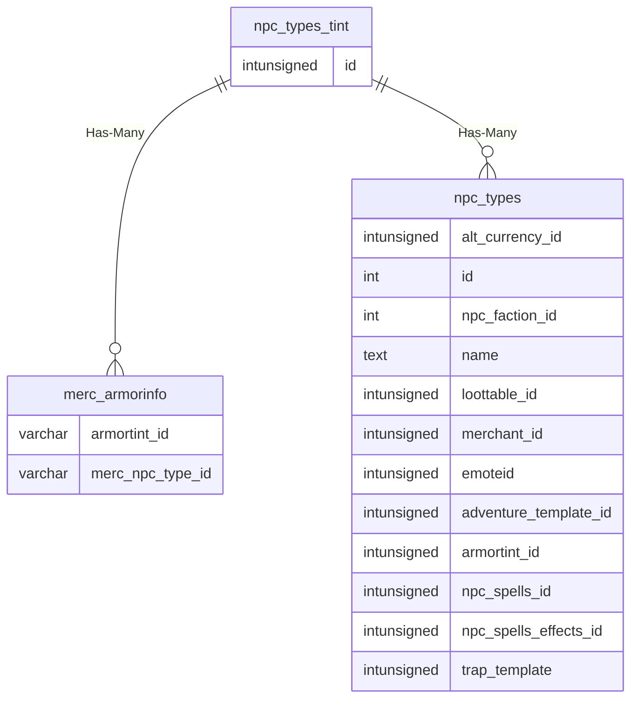

# npc_types_tint

## Relationships

| Relationship Type | Local Key | Relates to Table | Foreign Key |
| :--- | :--- | :--- | :--- |
| Has-Many | id | [merc_armorinfo](../../schema/mercenaries/merc_armorinfo.md) | armortint_id |
| Has-Many | id | [npc_types](../../schema/npcs/npc_types.md) | armortint_id |

## Schema

| Column | Data Type | Description |
| :--- | :--- | :--- |
| id | int | Unique NPC Type Tint Identifier |
| tint_set_name | text | Tint Set Name |
| red1h | tinyint | Red for Helmet: 0 = None, 255 = Max |
| grn1h | tinyint | Green for Helmet: 0 = None, 255 = Max |
| blu1h | tinyint | Blue for Helmet: 0 = None, 255 = Max |
| red2c | tinyint | Red for Chest: 0 = None, 255 = Max |
| grn2c | tinyint | Green for Chest: 0 = None, 255 = Max |
| blu2c | tinyint | Blue for Chest: 0 = None, 255 = Max |
| red3a | tinyint | Red for Arms: 0 = None, 255 = Max |
| grn3a | tinyint | Green for Arms: 0 = None, 255 = Max |
| blu3a | tinyint | Blue for Arms: 0 = None, 255 = Max |
| red4b | tinyint | Red for Bracers: 0 = None, 255 = Max |
| grn4b | tinyint | Green for Bracers: 0 = None, 255 = Max |
| blu4b | tinyint | Blue for Bracers: 0 = None, 255 = Max |
| red5g | tinyint | Red for Hands: 0 = None, 255 = Max |
| grn5g | tinyint | Green for Hands: 0 = None, 255 = Max |
| blu5g | tinyint | Blue for Hands: 0 = None, 255 = Max |
| red6l | tinyint | Red for Legs: 0 = None, 255 = Max |
| grn6l | tinyint | Green for Legs: 0 = None, 255 = Max |
| blu6l | tinyint | Blue for Legs: 0 = None, 255 = Max |
| red7f | tinyint | Red for Feet: 0 = None, 255 = Max |
| grn7f | tinyint | Green for Feet: 0 = None, 255 = Max |
| blu7f | tinyint | Blue for Feet: 0 = None, 255 = Max |
| red8x | tinyint | Red for Unknown: 0 = None, 255 = Max |
| grn8x | tinyint | Green for Unknown: 0 = None, 255 = Max |
| blu8x | tinyint | Blue for Unknown: 0 = None, 255 = Max |
| red9x | tinyint | Red for Unknown: 0 = None, 255 = Max |
| grn9x | tinyint | Green for Unknown: 0 = None, 255 = Max |
| blu9x | tinyint | Blue for Unknown: 0 = None, 255 = Max |

