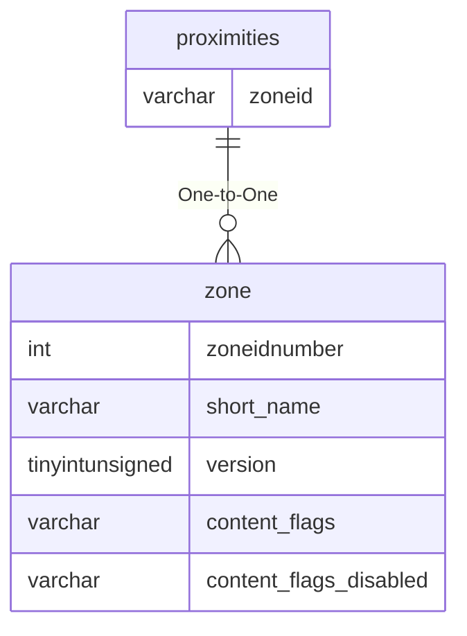

# proximities

## Relationships

| Relationship Type | Local Key | Relates to Table | Foreign Key |
| :--- | :--- | :--- | :--- |
| One-to-One | zoneid | [zone](../../schema/zone/zone.md) | zoneidnumber |

## Schema

| Column | Data Type | Description |
| :--- | :--- | :--- |
| zoneid | int | [Zone Identifier](../../../../server/zones/zone-list) |
| exploreid | int | [Explore Identifier](../../schema/tasks/goallists.md) |
| minx | float | Minimum X Coordinate |
| maxx | float | Maximum X Coordinate |
| miny | float | Minimum Y Coordinate |
| maxy | float | Maximum Y Coordinate |
| minz | float | Minimum Z Coordinate |
| maxz | float | Maximum Z Coordinate |

