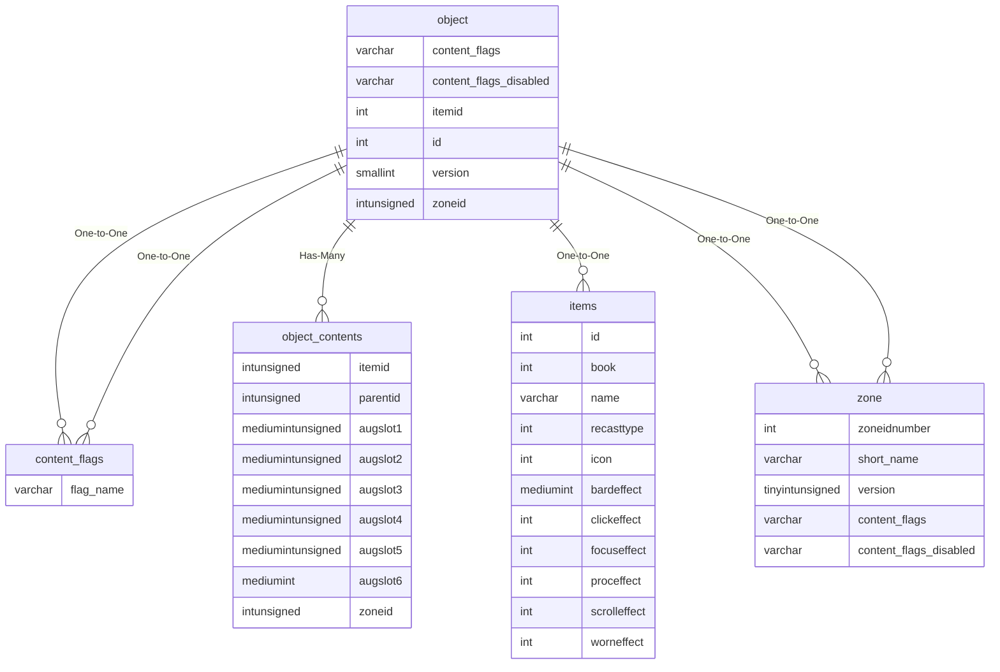

# object

!!! info
	This page was last generated 2024.02.07

## Relationship Diagram(s)

## Relationships

| Relationship Type | Local Key | Relates to Table | Foreign Key |
| :--- | :--- | :--- | :--- |
| One-to-One | content_flags | [content_flags](../../schema/flagging/content_flags.md) | flag_name |
| One-to-One | content_flags_disabled | [content_flags](../../schema/flagging/content_flags.md) | flag_name |
| Has-Many | id | [object_contents](../../schema/objects/object_contents.md) | parentid |
| One-to-One | itemid | [items](../../schema/items/items.md) | id |
| One-to-One | version | [zone](../../schema/zone/zone.md) | version |
| One-to-One | zoneid | [zone](../../schema/zone/zone.md) | zoneidnumber |

## Schema

| Column | Data Type | Description |
| :--- | :--- | :--- |
| id | int | Unique Object Identifier |
| zoneid | int | [Zone Identifier](../../../../server/zones/zone-list) |
| version | smallint | Version: -1 For All |
| xpos | float | X Coordinate |
| ypos | float | Y Coordinate |
| zpos | float | Z Coordinate |
| heading | float | Heading Coordinate |
| itemid | int | [Item Identifier](../../schema/items/items.md) |
| charges | smallint | Charges |
| objectname | varchar | Object Name |
| type | int | [Type](../../../../server/zones/object-types) |
| icon | int | Icon |
| unknown08 | mediumint | Unknown |
| unknown24 | int | Unknown |
| unknown20 | int | Unknown |
| unknown64 | int | Unknown |
| unknown68 | int | Unknown |
| unknown72 | int | Unknown |
| unknown76 | int | Unknown |
| unknown84 | int | Unknown |
| size | float | Size |
| solid_type | mediumint |  |
| incline | int |  |
| tilt_x | float | Tilt X |
| tilt_y | float | Tilt Y |
| display_name | varchar | Display Name |
| min_expansion | tinyint | [Minimum Expansion](../../../../server/operation/expansion-list) |
| max_expansion | tinyint | [Maximum Expansion](../../../../server/operation/expansion-list) |
| content_flags | varchar | Content Flags Required to be Enabled |
| content_flags_disabled | varchar | Content Flags Required to be Disabled |

