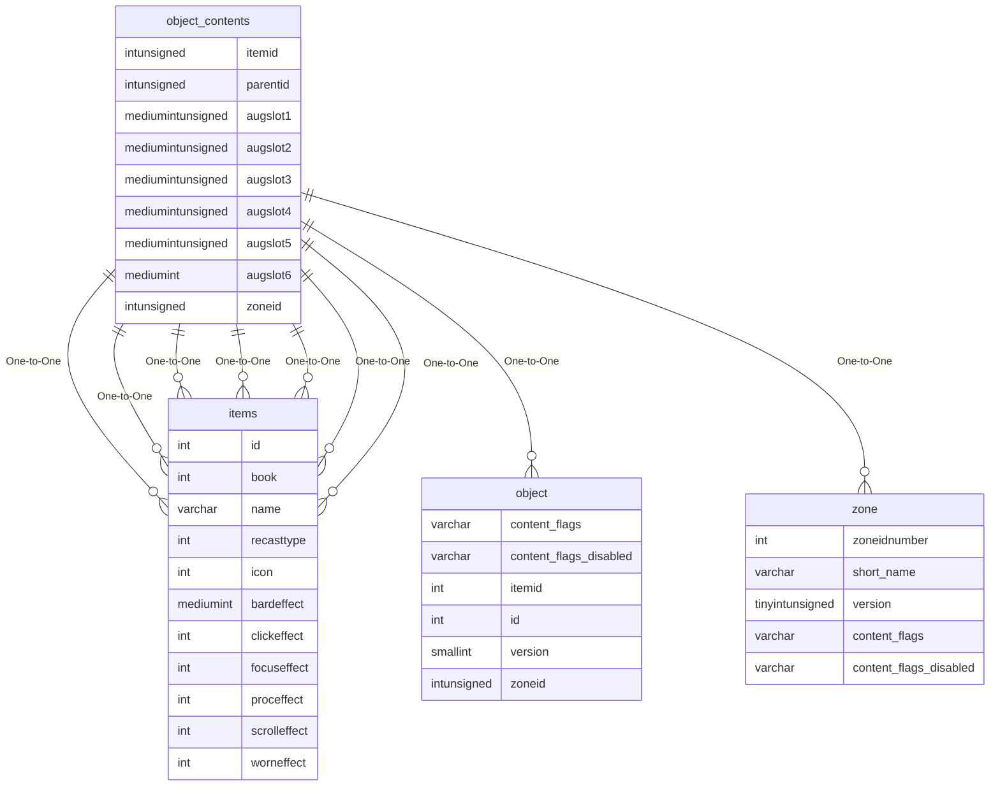

# object_contents

## Relationships

| Relationship Type | Local Key | Relates to Table | Foreign Key |
| :--- | :--- | :--- | :--- |
| One-to-One | augslot1 | [items](../../schema/items/items.md) | id |
| One-to-One | augslot2 | [items](../../schema/items/items.md) | id |
| One-to-One | augslot3 | [items](../../schema/items/items.md) | id |
| One-to-One | augslot4 | [items](../../schema/items/items.md) | id |
| One-to-One | augslot5 | [items](../../schema/items/items.md) | id |
| One-to-One | augslot6 | [items](../../schema/items/items.md) | id |
| One-to-One | itemid | [items](../../schema/items/items.md) | id |
| One-to-One | parentid | [object](../../schema/objects/object.md) | id |
| One-to-One | zoneid | [zone](../../schema/zone/zone.md) | zoneidnumber |

## Schema

| Column | Data Type | Description |
| :--- | :--- | :--- |
| zoneid | int | [Zone Identifier](../../../../server/zones/zone-list) |
| parentid | int | [Object Identifier](object.md) |
| bagidx | int | Bag Index |
| itemid | int | [Item Identifier](../../schema/items/items.md) |
| charges | smallint | Charges |
| droptime | datetime | Drop Time |
| augslot1 | mediumint | Augment Slot 1 |
| augslot2 | mediumint | Augment Slot 2 |
| augslot3 | mediumint | Augment Slot 3 |
| augslot4 | mediumint | Augment Slot 4 |
| augslot5 | mediumint | Augment Slot 5 |
| augslot6 | mediumint | Augment Slot 6 |

