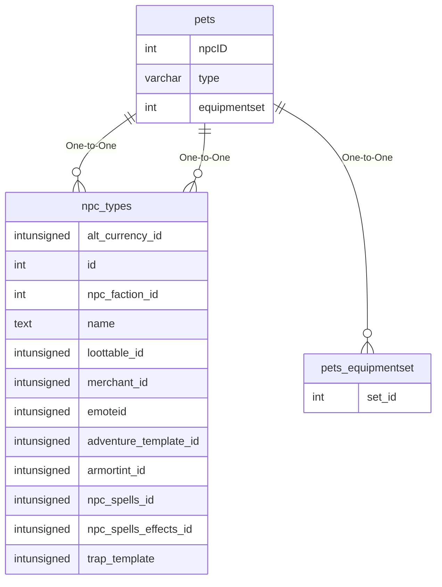

# pets

## Relationships

| Relationship Type | Local Key | Relates to Table | Foreign Key |
| :--- | :--- | :--- | :--- |
| One-to-One | npcID | [npc_types](../../schema/npcs/npc_types.md) | id |
| One-to-One | type | [npc_types](../../schema/npcs/npc_types.md) | name |
| One-to-One | equipmentset | [pets_equipmentset](../../schema/pets/pets_equipmentset.md) | set_id |

## Schema

| Column | Data Type | Description |
| :--- | :--- | :--- |
| id | int | Unique Pet Identifier |
| type | varchar | [NPC Type Name](../../schema/npcs/npc_types.md) |
| petpower | int | Pet Power |
| npcID | int | [NPC Type Identifier](../../schema/npcs/npc_types.md) |
| temp | tinyint | Temporary: 0 = False, 1 = True |
| petcontrol | tinyint | Pet Control: 0 = No Control, 1 = No Attack Control, 2 = Full Control |
| petnaming | tinyint | Pet Naming: 0 = Soandsos Pet, 1 = Soandsos Familiar, 2 = Soandsos Warder, 3 = Random Naming (i.e. Gobaner), 4 = Keeps name from npc_types table |
| monsterflag | tinyint | Monster Flag: 0 = False, 1 = True |
| equipmentset | int | [Pet Equipment Set Identifier](../../schema/pets/pets_equipmentset.md) |

