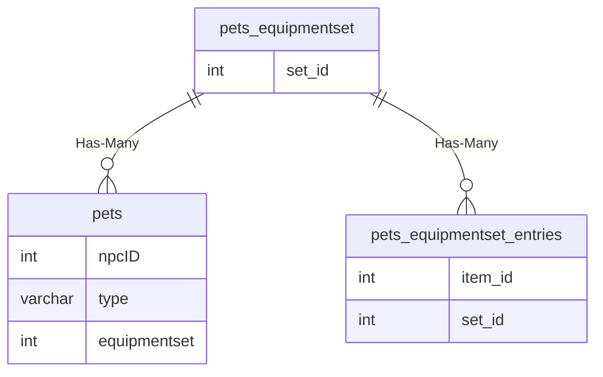

# pets_equipmentset

## Relationships

| Relationship Type | Local Key | Relates to Table | Foreign Key |
| :--- | :--- | :--- | :--- |
| Has-Many | set_id | [pets](../../schema/pets/pets.md) | equipmentset |
| Has-Many | set_id | [pets_equipmentset_entries](../../schema/pets/pets_equipmentset_entries.md) | set_id |

## Schema

| Column | Data Type | Description |
| :--- | :--- | :--- |
| set_id | int | Unique Pet Equipment Set Identifier |
| setname | varchar | Pet Equipment Set Name |
| nested_set | int | Nested Set Identifier |

