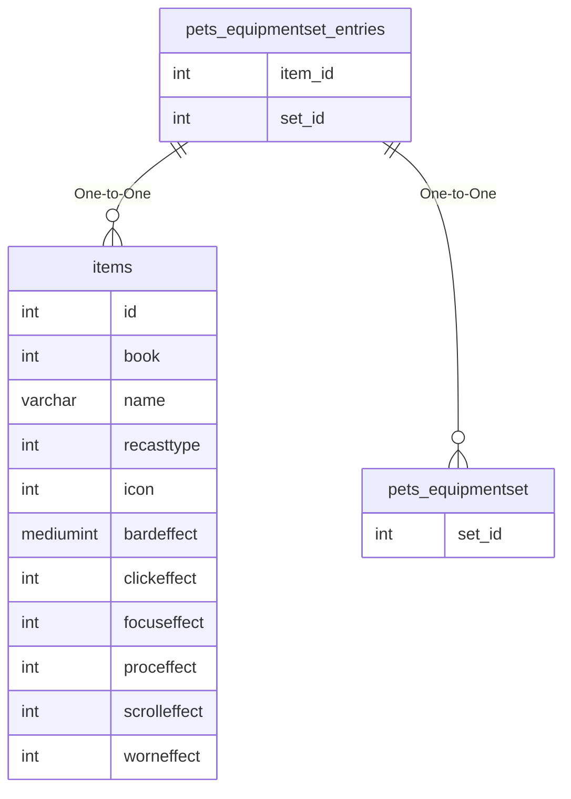

# pets_equipmentset_entries

## Relationships

| Relationship Type | Local Key | Relates to Table | Foreign Key |
| :--- | :--- | :--- | :--- |
| One-to-One | item_id | [items](../../schema/items/items.md) | id |
| One-to-One | set_id | [pets_equipmentset](../../schema/pets/pets_equipmentset.md) | set_id |

## Schema

| Column | Data Type | Description |
| :--- | :--- | :--- |
| set_id | int | [Pet Equipment Set Identifier](pets_equipmentset.md) |
| slot | int | Slot |
| item_id | int | [Item Identifier](../../schema/items/items.md) |

