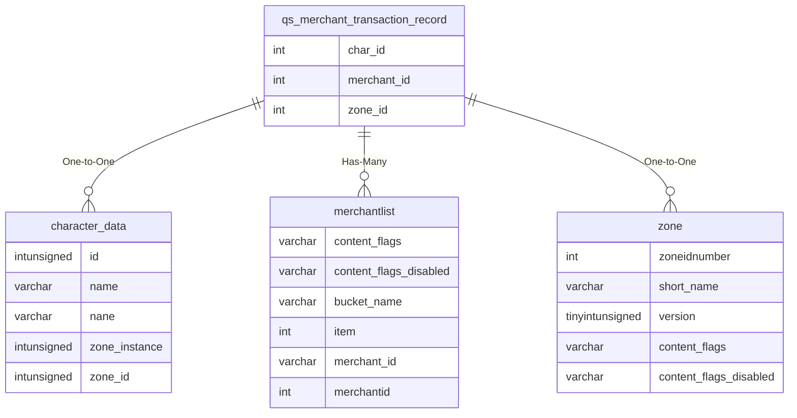

# qs_merchant_transaction_record

## Relationships

| Relationship Type | Local Key | Relates to Table | Foreign Key |
| :--- | :--- | :--- | :--- |
| One-to-One | char_id | [character_data](../../schema/characters/character_data.md) | id |
| Has-Many | merchant_id | [merchantlist](../../schema/merchants/merchantlist.md) | merchantid |
| One-to-One | zone_id | [zone](../../schema/zone/zone.md) | zoneidnumber |

## Schema

| Column | Data Type | Description |
| :--- | :--- | :--- |
| transaction_id | int | Unique Transaction Identifier |
| time | timestamp | Timestamp |
| zone_id | int | [Zone Identifier](../../../../server/zones/zone-list) |
| merchant_id | int | [Merchant Identifier](../../schema/merchants/merchantlist.md) |
| merchant_pp | int | Merchant Platinum |
| merchant_gp | int | Merchant Gold |
| merchant_sp | int | Merchant Silver |
| merchant_cp | int | Merchant Copper |
| merchant_items | mediumint | Merchant Items |
| char_id | int | [Unique Character Identifier](../../schema/characters/character_data.md) |
| char_pp | int | Character Platinum |
| char_gp | int | Character Gold |
| char_sp | int | Character Silver |
| char_cp | int | Character Copper |
| char_items | mediumint | Character Items |

