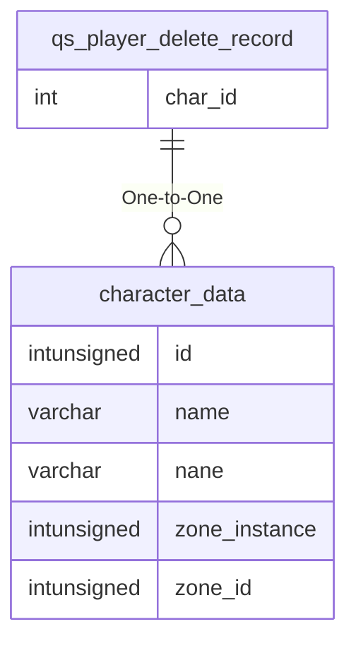

# qs_player_delete_record

!!! info
	This page was last generated 2024.02.07

## Relationship Diagram(s)

## Relationships

| Relationship Type | Local Key | Relates to Table | Foreign Key |
| :--- | :--- | :--- | :--- |
| One-to-One | char_id | [character_data](../../schema/characters/character_data.md) | id |

## Schema

| Column | Data Type | Description |
| :--- | :--- | :--- |
| delete_id | int | Unique Delete Identifier |
| time | timestamp | Time Timestamp |
| char_id | int | [Character Identifier](../../schema/characters/character_data.md) |
| stack_size | mediumint | Stack Size |
| char_items | mediumint | [Character Items Identifier](../../schema/items/items.md) |

