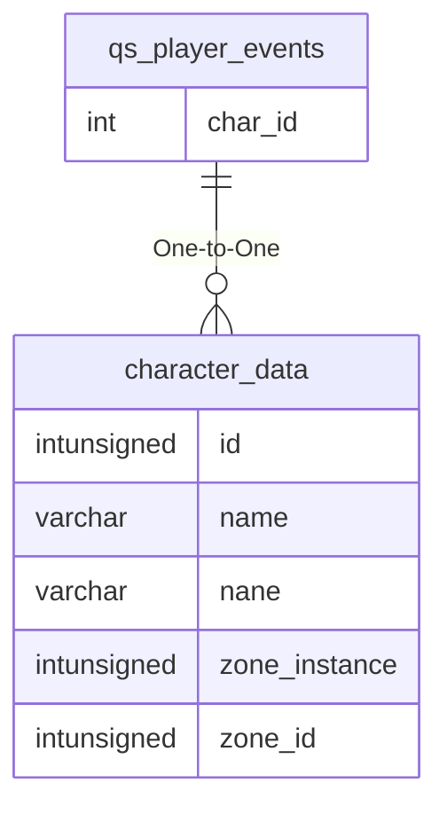

# qs_player_events

## Relationships

| Relationship Type | Local Key | Relates to Table | Foreign Key |
| :--- | :--- | :--- | :--- |
| One-to-One | char_id | [character_data](../../schema/characters/character_data.md) | id |

## Schema

| Column | Data Type | Description |
| :--- | :--- | :--- |
| id | int | Unique Event Identifier |
| char_id | int | [Character Identifier](../../schema/characters/character_data.md) |
| event | int | Event |
| event_desc | varchar | Event Description |
| time | int | Time UNIX Timestamp |

