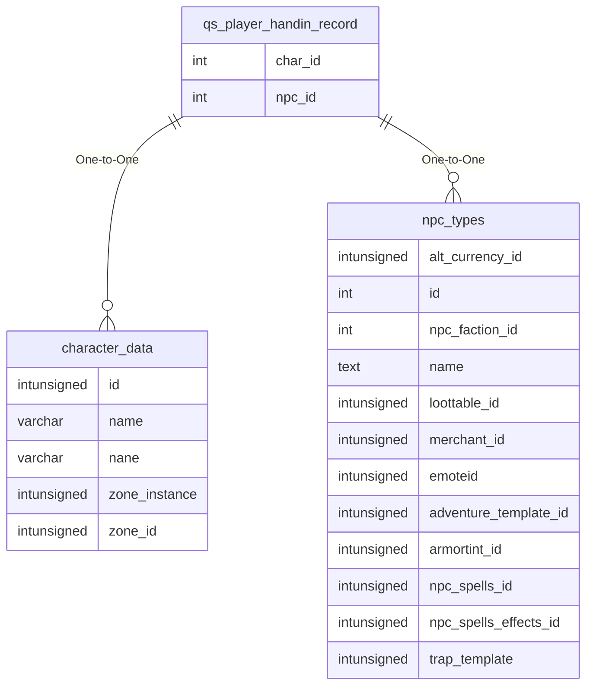

# qs_player_handin_record

## Relationships

| Relationship Type | Local Key | Relates to Table | Foreign Key |
| :--- | :--- | :--- | :--- |
| One-to-One | char_id | [character_data](../../schema/characters/character_data.md) | id |
| One-to-One | npc_id | [npc_types](../../schema/npcs/npc_types.md) | id |

## Schema

| Column | Data Type | Description |
| :--- | :--- | :--- |
| handin_id | int | Unique Handin Identifier |
| time | timestamp | Time Timestamp |
| quest_id | int | [Quest Identifier](../../schema/tasks/tasks.md) |
| char_id | int | [Character Identifier](../../schema/characters/character_data.md) |
| char_pp | int | Character Platinum |
| char_gp | int | Character Gold |
| char_sp | int | Character Silver |
| char_cp | int | Character Copper |
| char_items | mediumint | [Character Items Identifier](../../schema/items/items.md) |
| npc_id | int | [NPC Type Identifier](../../schema/npcs/npc_types.md) |
| npc_pp | int | NPC Platinum |
| npc_gp | int | NPC Gold |
| npc_sp | int | NPC Silver |
| npc_cp | int | NPC Copper |
| npc_items | mediumint | [NPC Item Identifier](../../schema/items/items.md) |

