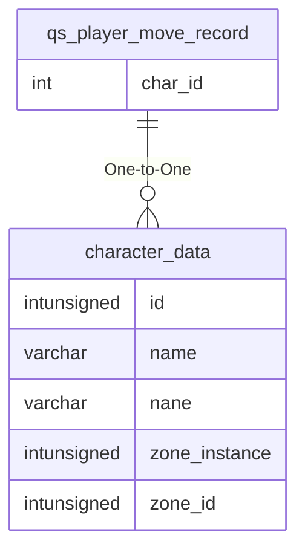

# qs_player_move_record

## Relationships

| Relationship Type | Local Key | Relates to Table | Foreign Key |
| :--- | :--- | :--- | :--- |
| One-to-One | char_id | [character_data](../../schema/characters/character_data.md) | id |

## Schema

| Column | Data Type | Description |
| :--- | :--- | :--- |
| move_id | int | Unique Move Identifier |
| time | timestamp | Time Timestamp |
| char_id | int | [Character Identifier](../../schema/characters/character_data.md) |
| from_slot | mediumint | [From Slot Identifier](../../../../server/inventory/inventory-slots) |
| to_slot | mediumint | [To Slot Identifier](../../../../server/inventory/inventory-slots) |
| stack_size | mediumint | Stack Size |
| char_items | mediumint | [Character Item Identifier](../../schema/items/items.md) |
| postaction | tinyint | Post Action |

