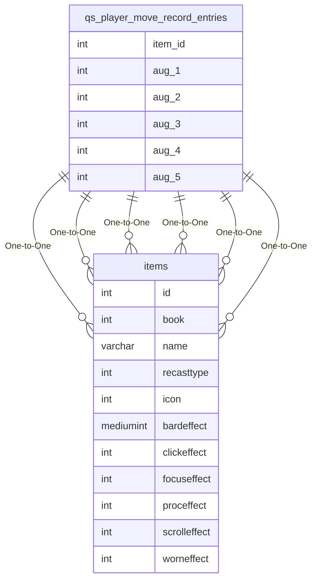

# qs_player_move_record_entries

!!! info
	This page was last generated 2024.02.07

## Relationship Diagram(s)

## Relationships

| Relationship Type | Local Key | Relates to Table | Foreign Key |
| :--- | :--- | :--- | :--- |
| One-to-One | aug_1 | [items](../../schema/items/items.md) | id |
| One-to-One | aug_2 | [items](../../schema/items/items.md) | id |
| One-to-One | aug_3 | [items](../../schema/items/items.md) | id |
| One-to-One | aug_4 | [items](../../schema/items/items.md) | id |
| One-to-One | aug_5 | [items](../../schema/items/items.md) | id |
| One-to-One | item_id | [items](../../schema/items/items.md) | id |

## Schema

| Column | Data Type | Description |
| :--- | :--- | :--- |
| event_id | int | Unique Event Identifier |
| from_slot | mediumint | [From Slot Identifier](../../../../server/inventory/inventory-slots) |
| to_slot | mediumint | [To Slot Identifier](../../../../server/inventory/inventory-slots) |
| item_id | int | [Item Identifier](../../schema/items/items.md) |
| charges | mediumint | Charges |
| aug_1 | int | Augment Slot 1 |
| aug_2 | int | Augment Slot 2 |
| aug_3 | int | Augment Slot 3 |
| aug_4 | int | Augment Slot 4 |
| aug_5 | int | Augment Slot 5 |

