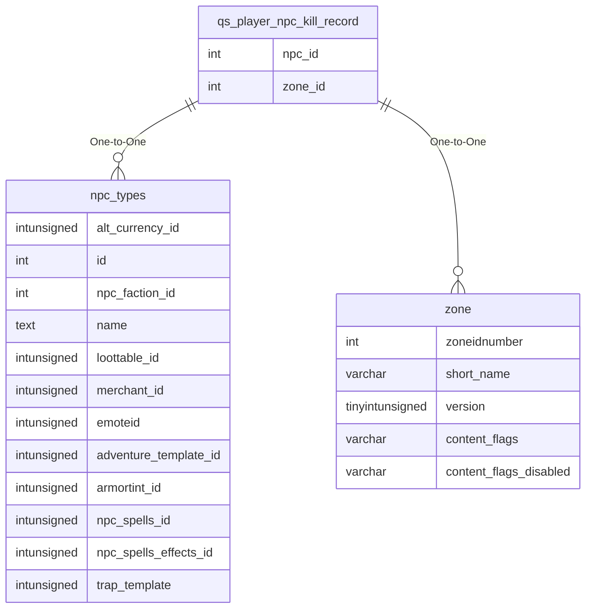

# qs_player_npc_kill_record

## Relationships

| Relationship Type | Local Key | Relates to Table | Foreign Key |
| :--- | :--- | :--- | :--- |
| One-to-One | npc_id | [npc_types](../../schema/npcs/npc_types.md) | id |
| One-to-One | zone_id | [zone](../../schema/zone/zone.md) | zoneidnumber |

## Schema

| Column | Data Type | Description |
| :--- | :--- | :--- |
| fight_id | int | Unique Fight Identifier |
| npc_id | int | [NPC Type Identifier](../../schema/npcs/npc_types.md) |
| type | int | Type (2 - Raid, 1 - Group, 0 - Solo) |
| zone_id | int | [Zone Identifier](../../../../server/zones/zone-list) |
| time | timestamp | Time Timestamp |

