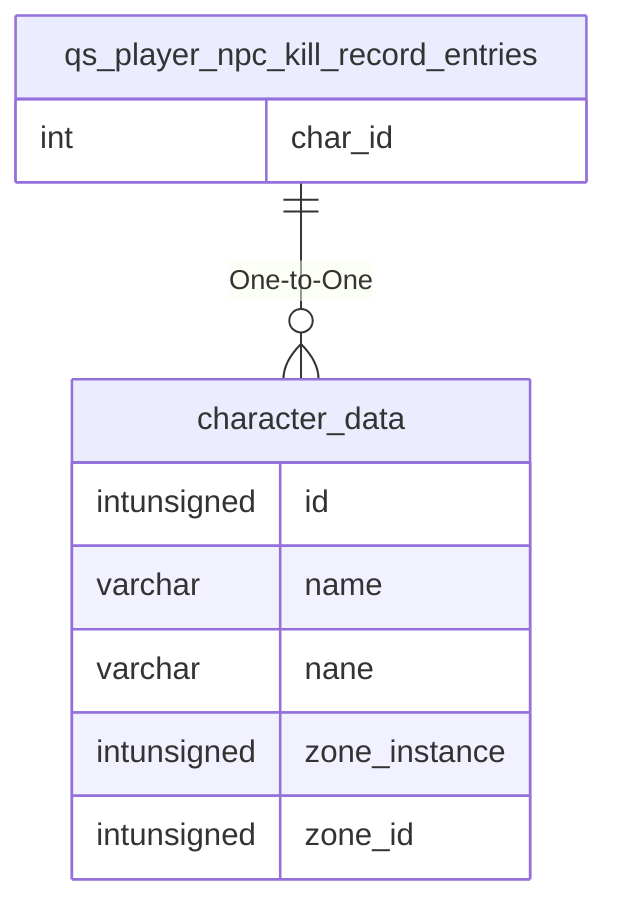

# qs_player_npc_kill_record_entries

## Relationships

| Relationship Type | Local Key | Relates to Table | Foreign Key |
| :--- | :--- | :--- | :--- |
| One-to-One | char_id | [character_data](../../schema/characters/character_data.md) | id |

## Schema

| Column | Data Type | Description |
| :--- | :--- | :--- |
| event_id | int | Unique Event Identifier |
| char_id | int | [Character Identifier](../../schema/characters/character_data.md) |

